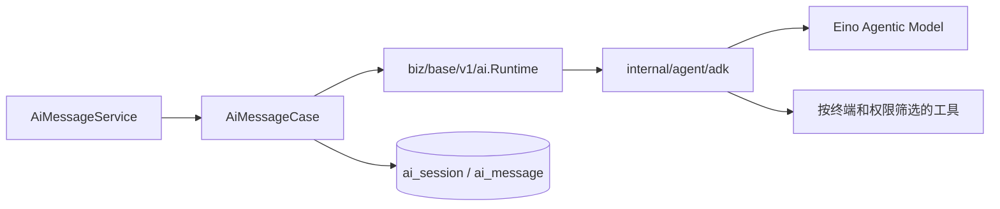

# AI 助手

AI 助手是管理端、uni-app 和 Taro 应用端共用的会话能力。三个入口使用同一组 `base.v1` 接口和数据表，但按终端筛选可用工具和快捷入口。

## 已实现能力

- 会话创建、列表、重命名、删除和持久化分支。
- 消息列表、文本与附件发送、编辑最后一条消息、删除、失败重试和重新生成。
- `delta`、`finish`、`error` 三类 SSE 事件的直接流式响应。
- Markdown、模型来源、Token、首 Token 耗时、总耗时和工具调用记录。
- 按终端、接口开关和用户权限筛选生成的 Agent Tool。
- 固定流程快捷入口和结构化动作；旧消息动作会被服务端判定为过期。
- Responses 服务端工具记录；当前模型未启用时返回明确的不可用错误。

## 契约和数据

| 能力 | Proto | HTTP 前缀 |
| --- | --- | --- |
| 快捷入口 | `backend/api/proto/base/v1/ai_tool.proto` | `/api/v1/base/ai/shortcut` |
| 会话 | `ai_session.proto` | `/api/v1/base/ai/session` |
| 消息 | `ai_message.proto` | `/api/v1/base/ai/session/{session_id}/message` |

数据持久化到 `ai_session` 和 `ai_message`。一轮消息保存输入、输出、附件、工具、Token、耗时、状态和可选结构化流程内容。动作必须携带当前最新成功消息的 `source_message_id`、`action_id` 和 `flow_version`。

发送消息的 HTTP handler 直接返回 `text/event-stream`，不使用通用 `/events/{stream}` 订阅。流结束时 `finish` 事件返回最终消息和更新后的会话。

## 后端链路

`internal/biz/base/v1/ai` 负责业务协议、历史消息、附件、终端策略、固定流程和结果持久化；`internal/agent` 隔离 Eino 的模型、消息、ADK、Middleware、Callback、Tool、Structured 和 Workflow 细节。

Agent Tool 来自生成代码，`agent_status` 控制是否可被 AI 使用；`mcp_status` 独立控制是否暴露为 MCP Tool。两者不是同一个开关。

## 管理端

管理端位于 `frontend/admin/packages/modules/system/src/views/ai/chat`：

| 文件 | 职责 |
| --- | --- |
| `index.vue` | 会话、消息、发送和动作总编排。 |
| `components/SessionPanel.vue` | 会话搜索、创建、切换、重命名和删除。 |
| `components/ChatPanel.vue` | 消息区、空态、快捷入口和消息操作。 |
| `components/XSender.vue` | 文本、附件和发送状态。 |
| `components/AiMarkdown.vue` | Markdown 与代码内容。 |
| `stream.ts`、`message.ts` | SSE 解析和消息状态归一化。 |

System 模块还把 AI 图标注册为顶部工具。结构化流程块组件不是内置固定实现；其他业务模块可通过 `ADMIN_AI_EXTENSION` 提供 `flowBlocks` 扩展。

## 应用端

uni-app 位于 `frontend/uni-app/packages/modules/system/src/views/pagesMember/ai`，Taro 位于 `frontend/taro-app/packages/modules/system/src/views/pagesMember/ai`。两端都提供会话抽屉、欢迎快捷入口、输入与附件、消息流和多端 SSE 解析，页面属于 `pagesMember` 分包，使用同一 `base.v1` RPC 和 API 封装。H5 使用 Fetch SSE；微信小程序使用各自平台的分块请求能力。

## 配置与验证

模型配置位于 `backend/configs/ai.yaml` 和 `ai_local.yaml`。未提供模型配置时服务仍可启动，但 AI 运行时处于关闭状态。

修改协议或运行时后执行后端生成与测试；修改管理端执行 `pnpm lint:oxlint`、`pnpm type:check`；修改 uni-app 或 Taro 执行对应 workspace 的 `pnpm lint`、`pnpm tsc`，涉及模块协议或 runner 时再执行 `pnpm test`、`pnpm check:exports`。前端至少检查空会话、历史会话、发送中、失败、附件和过期流程动作状态。
