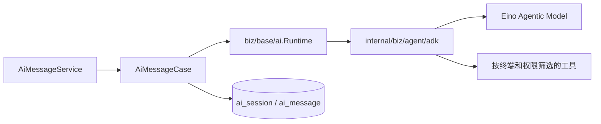

# AI 助手

AI 助手是管理端、uni-app 和 Taro 应用端共用的会话能力。三个入口使用同一组 `base.v1` 接口和数据表，但按终端筛选可用工具和快捷入口。

## 已实现能力

- 会话创建、列表、重命名、删除和持久化分支。
- 消息列表、文本与附件发送、编辑最后一条消息、删除、失败重试和重新生成。
- `delta`、`finish`、`error` 三类 SSE 事件的直接流式响应。
- Markdown、模型来源、Token、首 Token 耗时、总耗时和工具调用记录。
- 按终端、接口开关和用户权限筛选生成的 Agent Tool。
- 固定流程快捷入口和结构化动作；旧消息动作会被服务端判定为过期。
- Responses 服务端工具记录；当前模型未启用时返回明确的不可用错误。

## 契约和数据

| 能力 | Proto | HTTP 前缀 |
| --- | --- | --- |
| 快捷入口 | `backend/api/proto/base/v1/ai_tool.proto` | `/api/v1/base/ai/shortcut` |
| Provider 模型选项 | `backend/api/proto/base/v1/ai_provider.proto` | `/api/v1/base/ai/provider-models` |
| 会话 | `ai_session.proto` | `/api/v1/base/ai/session` |
| 消息 | `ai_message.proto` | `/api/v1/base/ai/session/{session_id}/message` |
| 智能问数 | `ai_query.proto` | `/api/v1/base/ai/query/ask`、`/api/v1/base/ai/query/tables` |

数据持久化到 `ai_session` 和 `ai_message`。一轮消息保存输入、输出、附件、工具、Token、耗时、状态和可选结构化流程内容。动作必须携带当前最新成功消息的 `source_message_id`、`action_id` 和 `flow_version`。智能问数每次调用（含失败）都会在 `ai_query` 表留痕：提问内容、生成的 SQL、状态、结果行数、SQL 执行耗时和失败原因。

发送消息的 HTTP handler 直接返回 `text/event-stream`，不使用通用 `/events/{stream}` 订阅。流结束时 `finish` 事件返回最终消息和更新后的会话。

## 后端链路

```mermaid
flowchart LR
  API["AiMessageService"] --> Case["AiMessageCase"]
  Case --> Runtime["biz/base/ai.Runtime"]
  Runtime --> ADK["internal/biz/agent/adk"]
  ADK --> Model["Eino Agentic Model"]
  ADK --> Tools["按终端和权限筛选的工具"]
  Case --> DB[("ai_session / ai_message")]
```

`internal/biz/base/ai` 负责业务协议、历史消息、附件、终端策略、固定流程和结果持久化；`internal/biz/agent` 隔离 Eino 的模型、消息、ADK、Middleware、Callback、Tool、Structured 和 Workflow 细节。

Agent Tool 来自生成代码，`agent_status` 控制是否可被 AI 使用；`mcp_status` 独立控制是否暴露为 MCP Tool。两者不是同一个开关。

## 智能问数

智能问数以 Agent Tool 形态接入会话：模型在对话中判定用户在做数据统计类提问时调用 `base_v1_ai_query_service_ask_ai_query`，必要时先用 `base_v1_ai_query_service_option_ai_query_table` 查看可用表目录，工具返回结构化结果后由模型组织自然语言回答，天然支持多轮追问。核心逻辑在 `backend/internal/biz/base/ai_query.go`。

一次问数链路：

1. 从 `information_schema` 读取白名单表结构（表注释、字段、类型），白名单在 `aiQueryTableWhitelist` 中显式登记；
2. 把表结构字典、规则和 few-shot 注入提示词，调用当前默认模型生成 SQL（模型只写 `tenant_id = -1` 占位条件）；
3. 确定性护栏：只允许 `SELECT`/`WITH`、拒绝危险关键字与多语句、引用表逐一到白名单校验（含逗号连接与子查询内部表）、引用租户表时强制存在 `tenant_id` 等值条件并重写为当前租户、`LIMIT` 钳制到 50 行；
4. 在只读事务（`TxOptions{ReadOnly: true}`）中执行，15 秒超时，结果按 50 行与 48KB 双重截断后以 `{sql, columns, rows, row_count, truncated, elapsed_ms}` 返回。

安全边界全部在确定性代码中，不依赖模型承诺；白名单表可在 `aiQueryTableWhitelist` 按部署调整。两个问数工具的开箱启用种子位于 `backend/migration/assets/v0.0.1/mysql/default_data.up.sql`（`agent_status` 启用、`mcp_status` 禁用），也可在管理端“接口管理”中调整。

`ai_query` 留痕表由 GORM 自动迁移创建（模型注册在 `internal/data/gen/data` 的 `Models()`），生成 SQL 无论成功与否都落库（失败时 `status=2` 并记录 `error_msg`，护栏拒绝的 SQL 也会留痕便于调优）。新表需同步登记 `backend/Makefile` 的 `GORM_TABLE` 后执行 `make gorm-gen`。

## 管理端

管理端位于 `frontend/admin/packages/modules/system/src/views/ai/chat`：

| 文件 | 职责 |
| --- | --- |
| `index.vue` | 会话、消息、发送和动作总编排。 |
| `components/SessionPanel.vue` | 会话搜索、创建、切换、重命名和删除。 |
| `components/ChatPanel.vue` | 消息区、空态、快捷入口和消息操作。 |
| `components/XSender.vue` | 文本、附件和发送状态。 |
| `components/AiMarkdown.vue` | Markdown 与代码内容。 |
| `stream.ts`、`message.ts` | SSE 解析和消息状态归一化。 |

AI 助手目录下另有管理页面：`views/base/ai-provider`（AI 供应商）、`views/ai/session`（AI 会话）和 `views/ai/query`（智能问数留痕列表，分页查看每次问数的问题、生成 SQL、状态、行数与耗时，通过 `system.admin.v1.AiQueryService` 查询 `ai_query` 表）。AI 知识库在独立模块 `frontend/admin/packages/modules/rag`（`@liujitcn/kratos-admin-rag`），页面为该包的 `views/ai-knowledge`。

System 模块还把 AI 图标注册为顶部工具。结构化流程块组件不是内置固定实现；其他业务模块可通过 `ADMIN_AI_EXTENSION` 提供 `flowBlocks` 扩展。

## 应用端

uni-app 位于 `frontend/uni-app/packages/modules/system/src/views/pagesMember/ai`，Taro 位于 `frontend/taro-app/packages/modules/system/src/views/pagesMember/ai`。两端都提供会话抽屉、欢迎快捷入口、输入与附件、消息流和多端 SSE 解析，页面属于 `pagesMember` 分包，使用同一 `base.v1` RPC 和 API 封装。H5 使用 Fetch SSE；微信小程序使用各自平台的分块请求能力。

## AI 知识库

知识库是独立于会话主库的 RAG 能力，接口包为 `rag.admin.v1`（`backend/api/proto/rag/admin/v1/`），包含三个服务：`AiKnowledgeService`（知识库 CRUD 与模型选项）、`AiKnowledgeDocService`（文档分页、文本/文件上传、删除、重新处理）、`AiKnowledgeChunkService.SearchAiKnowledge`（检索），HTTP 前缀 `/api/v1/admin/rag/*`。

数据存储在独立 PostgreSQL 数据源（`backend/configs/data.yaml` 的 `data.databases.rag`，未配置时回落默认库），三张表：

| 表 | 关键字段 | 说明 |
| --- | --- | --- |
| `ai_knowledge` | `embedding_dimensions`、`model_id` | 知识库绑定 embedding 模型与向量维度 |
| `ai_knowledge_doc` | `knowledge_base_id`、`file_path`、`file_hash`、`status`、`error_message` | 文档状态走 `ai_knowledge_doc_status` 字典（1440），原始文件落对象存储并做 SHA256 校验 |
| `ai_knowledge_chunk` | `doc_id`、`chunk_index`、`content`、`embedding` | 向量以 TEXT 列存 JSON，不使用 pgvector |

引擎在 `backend/internal/biz/base/ai/knowledge.go`：入库时切片、调用 embedding 模型（OpenAI `CreateEmbeddings` 兼容协议，带超时与重试）并批量写切片，返回维度必须等于知识库配置维度；检索在应用侧计算余弦相似度。聊天发送消息时若选择了知识库（`knowledgeBaseIDs` 非空），`Retrieve` 结果注入 `input.KnowledgeContext`，任一知识库失败只记录日志不阻断会话。

embedding 必须使用真实 embedding 模型（如 `text-embedding-3-small`、`BAAI/bge-m3`）；订阅型 OAuth 账号通常没有 embeddings 能力，需配置 API Key 型供应商。

## AI 供应商与模型管理

供应商与模型由 `system.admin.v1.AiProviderService` 管理（`backend/api/proto/system/admin/v1/ai_provider.proto`）：分页、选项、详情、创建、更新、删除、状态切换和 `TestAiProviderModels` 连通性测试。测试使用当前表单草稿逐个调用模型（chat 与 embedding 分别构造请求），不保存任何配置，返回每个模型的耗时与失败消息。

`ai_provider` 表保存 `provider`（`openai_compatible` 或 `ollama`）、`base_url`、`api_key` 与 JSON `config`；`ai_model` 表通过 `provider_id` 挂在供应商下，`category` 为 `AiModelCategory` 枚举（`chat=1`、`embedding=2`、`rerank=3`、`image=4`、`video=5`、`audio=6`）。模型列表以 `AiProviderForm.models` 子列表随供应商表单在同一个事务内保存（按模型 ID upsert，保留 RAG 等外部引用）。

模型 API Key 的安全链路：表单提交 `common.v1.SecretCrypto` 密文（`api_key_configured` 表示已保存密钥），落库由密钥字段回调或 redact 存储策略加密，页面通过 `RevealSecretField` 眼睛查看，详见 [敏感字段加密设计](敏感字段加密设计.md)。对话端通过 `AiModelService.ListAiProviderModelOptions` 独立读取名称和模型列表，快捷入口仍由 `AiToolService.ListAiShortcut` 提供。发送消息时选择 Provider 与模型，凭据始终保留在服务端。未配置可用模型时 AI 运行时处于关闭状态。

## 配置与验证

修改协议或运行时后执行后端生成与测试；修改管理端执行 `pnpm lint:oxlint`、`pnpm type:check`；修改 uni-app 或 Taro 执行对应 workspace 的 `pnpm lint`、`pnpm tsc`，涉及模块协议或 runner 时再执行 `pnpm test`、`pnpm check:exports`。前端至少检查空会话、历史会话、发送中、失败、附件和过期流程动作状态。
