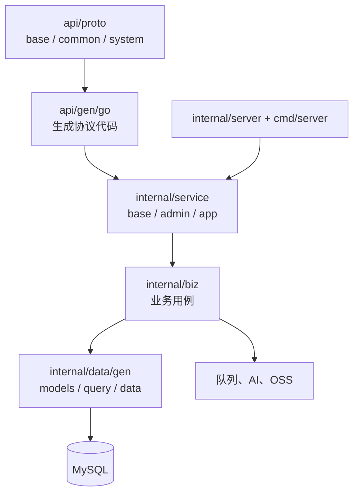
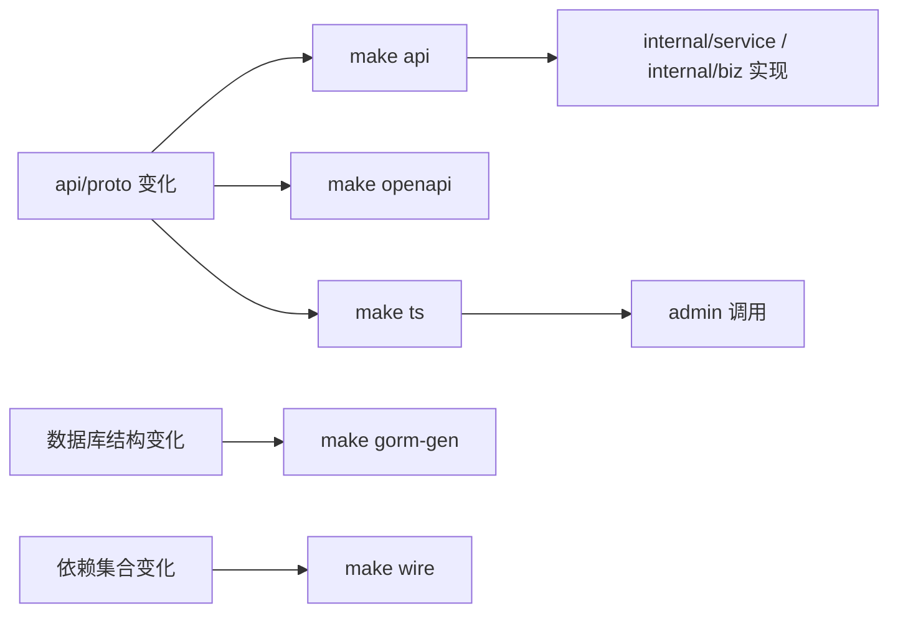

# 后端服务设计

## 文档定位

`backend` 是项目服务端模块。它以 Kratos 装配 HTTP、gRPC、SSE 与 MCP 入口，维护接口协议、领域服务、GORM 数据访问、运行任务、OpenAPI 和管理后台静态资源托管。

## 当前分层



| 目录 | 职责 |
| --- | --- |
| `api/proto` | 按公共能力和系统域划分的 Proto 契约。 |
| `api/gen/go` | Go、HTTP、gRPC、Agent Tool、MCP Tool 生成代码。 |
| `cmd/server` | 独立微服务启动入口。 |
| `internal/agent` | Eino 模型、工具、回调和工作流适配。 |
| `internal/service` | Proto 服务实现。 |
| `internal/biz` | 登录、权限、用户、租户、代码生成等 Case 和业务规则。 |
| `internal/config` | 配置解析和数据源初始化。 |
| `internal/const` | Backend 内部共享常量。 |
| `internal/data` | GORM 生成的 Model、Query、Repository 和队列适配。 |
| `internal/server` | 各域服务注册、HTTP/gRPC/MCP、中间件、OpenAPI 和静态资源路由。 |
| `app.go` | 对外暴露模块注册、本地 gRPC ClientConn 和独立应用构造。 |

## 域和终端划分

| 协议包 | 服务位置 | 消费端 |
| --- | --- | --- |
| `base.v1`、`common.v1` | `internal/service/base` | 管理后台与应用壳子共用。 |
| `system.admin.v1` | `internal/service/admin` | 系统管理后台。 |
| `system.app.v1` | `internal/service/app` | 应用壳子的系统兼容接口。 |

HTTP 路由由 Proto 中的 `google.api.http` 映射生成。业务服务接收生成请求并调用对应 Case；数据访问只在 Backend 内部使用 `internal/data/gen`。其他模块必须通过生成的 gRPC Client 使用这些数据，本地模式由 `Runtime.ClientConn()` 将调用分派到相同 Service/Case。菜单与接口权限同步维护在对应版本目录的 `<feature>.up.sql`。

## 生成与装配



`make gen` 顺序执行 Go、OpenAPI、管理端 TypeScript、应用端 TypeScript、GORM、Wire 和格式化。
以下目录为生成结果，禁止手工修改：`api/gen/go`、`internal/data/gen`、
`internal/server/assets/openapi.yaml`、`frontend/admin/src/rpc`、
`frontend/app/src/rpc`。

## 运行任务和异步链路

任务注册与静态 Cron 框架位于 `core/pkg/task`；`backend/internal/biz/job` 保留数据库任务配置、动态调度和执行日志适配。队列、任务或定时回调不继承请求上下文，涉及租户和权限口径时必须由数据显式确定范围。

## 外部能力

- AI：`internal/biz/base/ai` 管理会话、消息、SSE 和工具候选；`internal/agent` 隔离模型、工具、回调和中间件适配。
- MCP：服务启动时注册生成工具，并在现有 HTTP 服务上暴露 `/mcp/{terminal}`。
- 静态资源：`backend/data` 下含 `index.html` 的一级目录作为 SPA 挂载，当前管理后台使用 `/admin/`。

## 配置与验证

运行配置位于 `configs`：数据库使用 `data.yaml`/`data_local.yaml`，AI 使用 `ai.yaml`/`ai_local.yaml`，认证、OSS、OAuth、服务监听和日志分别由同名配置文件维护。

修改后端代码或契约时，至少执行：

```bash
cd backend
go test ./...
```

再按改动范围执行 `make api`、`make openapi`、`make ts`、`make ts-app`、
`make gorm-gen`、`make wire` 或 `make gen`。新增模块的完整装配步骤见
[服务接入指南](服务接入指南.md)。
