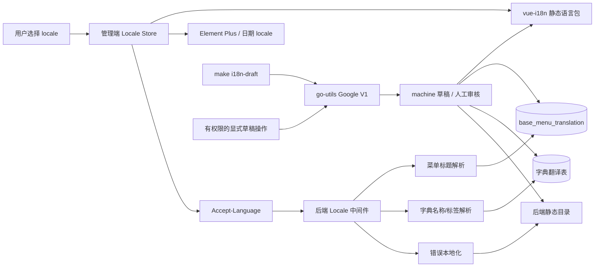

# 国际化最终方案

> 最终决策日期：2026-08-02
>
> 适用仓库：`kratos-admin` 及其 `backend`、`frontend/admin`、`frontend/uni-app`、`frontend/taro-app`
>
> 决策状态：已实施并通过静态检查、类型检查和构建验证
>
> 文档关系：本文合并并取代原《国际化设计》和《免费翻译工具调研》，是后续实施的唯一依据。

## 1. 最终决策

| 决策项 | 最终结论 |
| --- | --- |
| 支持语言 | `zh-CN`、`zh-TW`、`en-US`、`ja-JP`、`ko-KR`、`fr-FR`、`es-ES` |
| 固定 UI 默认语言 | `zh-CN`；动态资源主语言由 `base_language.is_primary` 配置 |
| 改造入口 | 后端错误与动态资源，以及管理端、uni-app、Taro 三个前端入口 |
| 固定 UI 文案 | 各前端 workspace 的 JSON 语言包与对应 locale runtime |
| 动态菜单 | `base_menu_translation`，后端按 locale 解析标题 |
| 动态字典 | `base_dict_translation`、`base_dict_item_translation`，后端按 locale 解析名称和标签 |
| 动态资源主语言权威值 | 主表保存 `base_language.is_primary` 指定的主语言文本；翻译表只存其他启用语言，不重复存主语言 |
| 后端错误 | 服务端静态 JSON 目录，响应前按 locale 本地化 `message` |
| 稳定错误契约 | 保持现有 `code/reason`；metadata 增加 `message_key/message_args` |
| 请求语言 | 管理端所有 Axios、刷新令牌、fetch、SSE 请求统一发送 `Accept-Language` |
| 语言偏好 | 管理端使用 `localStorage` 的 `kratos-admin:locale`；uni-app/Taro 使用 `kratos-app:locale`；不改 `base_user` |
| 机器翻译实现 | `github.com/liujitcn/go-utils/translator/google@v0.0.1`，显式 `google.WithVersion("v1")` |
| 机器翻译定位 | 只生成可审核草稿；不得进入普通 CRUD、菜单/字典读取、登录、鉴权、校验或错误响应链路 |
| 机器译文状态 | `machine`；人工确认后为 `reviewed`；源文变化后标记待复核 |
| 缺失翻译 | 静态内置文案在检查阶段失败；运行期动态数据回退到中文，绝不展示裸 key |
| 代码生成 | 新页面、菜单、按钮和错误必须同时生成稳定 key 与七语配置，缺非主语言时阻止正式生成 |

这不是把“国际化”委托给在线翻译。国际化的运行时能力必须完全独立于 Google V1；Google V1 仅减少第一次录入非主语言草稿的工作量。即使该端点永久不可用，已审核的七语界面、菜单、字典和错误仍应正常工作。

## 2. 已核实的现状与约束

### 2.1 `go-utils` 翻译模块已经可用

相邻仓库 `go-utils` 当前 `main` 位于提交 `9b0cea6`，远端已发布以下相关 tag：

```text
translator/v0.0.1
translator/google/v0.0.1
```

模块边界是独立的 Go module，而不是根模块 `github.com/liujitcn/go-utils` 的普通子包：

- 公共单文本接口见 [`translator/translator.go`](https://github.com/liujitcn/go-utils/blob/9b0cea6620c340e8d6e60193c9aac0290d1b7e00/translator/translator.go#L6)。
- Google Provider 的 module path 见 [`translator/google/go.mod`](https://github.com/liujitcn/go-utils/blob/9b0cea6620c340e8d6e60193c9aac0290d1b7e00/translator/google/go.mod#L1)。
- 安装和 V1 示例见 [`translator/google/README.md`](https://github.com/liujitcn/go-utils/blob/9b0cea6620c340e8d6e60193c9aac0290d1b7e00/translator/google/README.md#L5)。

`kratos-admin/backend` 当前只依赖根模块 `github.com/liujitcn/go-utils v0.0.33`，见 [`backend/go.mod`](../backend/go.mod#L16)。根模块版本不会自动提供独立子模块，因此实施时应显式增加：

```text
github.com/liujitcn/go-utils/translator v0.0.1
github.com/liujitcn/go-utils/translator/google v0.0.1
```

不需要仅为使用翻译子模块而升级现有根模块。最终以 `go mod tidy` 结果为准，不使用 `replace` 指向相邻工作区。

Google 子模块要求 Go `1.26.0`，本项目后端要求 Go `1.26.3`，版本方向兼容。已通过远端 tag 和 `go mod download` 核实 `translator/google@v0.0.1` 可下载。

### 2.2 这里的“Google V1”是什么

本文中的 Google V1 是 `go-utils` Provider 对下列实现分支的命名：

```text
GET https://translate.googleapis.com/translate_a/single
client=gtx
sl=<source language>
tl=<target language>
dt=t
q=<source text>
```

证据见 [`defaultV1Endpoint`](https://github.com/liujitcn/go-utils/blob/9b0cea6620c340e8d6e60193c9aac0290d1b7e00/translator/google/translator.go#L24) 和 [`TranslateV1`](https://github.com/liujitcn/go-utils/blob/9b0cea6620c340e8d6e60193c9aac0290d1b7e00/translator/google/translator.go#L92)。它具有以下真实行为：

- `NewTranslator` 默认就是 `v1`，但本项目仍必须显式传 `WithVersion("v1")`，避免默认值变化造成静默切换。
- 不需要 API Key、Google Cloud 项目或 ADC。
- 使用单条 GET 请求，正文进入 URL query。
- 支持 `context.Context` 取消；默认 HTTP client 超时 30 秒。
- 只实现单文本 `Translate`，没有实现 `BatchTranslator`。
- 响应最多读取 1 MiB，并拼接响应中的多个翻译片段。
- 非 200、响应格式变化、空结果、超时和网络失败都会返回 error。
- `Close` 只关闭 V2/V3 官方客户端；V1 不需要调用它来释放 Cloud client。

2026-08-02 使用 `sl=zh-CN`、`tl=en-US` 对“保存成功”做过一次连通性冒烟验证，端点返回 `Saved successfully`。该结果只证明当时可访问，不能证明未来可用性、限额或翻译质量。

### 2.3 它不是 Google Cloud Translation 官方 v1

Google Cloud 官方资料把产品区分为 Cloud Translation Basic 和 Advanced，官方 REST 参考列出 Basic v2 与 Advanced v3：

- [Cloud Translation editions](https://cloud.google.com/translate/docs/editions)
- [Cloud Translation REST reference](https://cloud.google.com/translate/docs/reference/rest)
- [Cloud Translation supported languages](https://cloud.google.com/translate/docs/languages)

`translate_a/single?client=gtx` 不在上述 Cloud Translation 官方 REST 契约中。`go-utils` 自己也明确将 V1 标为“非官方、无 SLA、可能限流或变更”，见 [`translator/README.md`](https://github.com/liujitcn/go-utils/blob/9b0cea6620c340e8d6e60193c9aac0290d1b7e00/translator/README.md#L7) 和 [`translator/google/README.md`](https://github.com/liujitcn/go-utils/blob/9b0cea6620c340e8d6e60193c9aac0290d1b7e00/translator/google/README.md#L11)。因此：

- 本文接受用户指定的 Google V1 作为低风险草稿 provider。
- 不将它描述为 Google Cloud Translation API v1。
- Google Cloud 的价格、配额、认证、SLA 和语言支持承诺不能套用到该端点。
- 后续如果要求生产 SLA，只替换 provider 为 go-utils Google V2/V3 或其他官方服务，不推翻本文的国际化架构。

### 2.4 与原两份文档的冲突决议

| 原结论 | 新事实或最终决策 | 本文处理 |
| --- | --- | --- |
| `liujitcn/go-utils` 没有 translator | `9b0cea6` 已新增并发布独立 translator modules | 直接依赖 `translator@v0.0.1` 和 `translator/google@v0.0.1` |
| 草稿 provider 首选阿里云官方 API | 用户最终指定 Google V1 | 当前只实现 go-utils Google V1，不同时实现其他 provider |
| Google V1/GTX 完全禁用 | 最终选型要求使用，但其非官方风险没有消失 | 只允许开发命令和有权限的显式草稿操作，严禁进入正常业务链路 |
| locale 文件建议使用 TypeScript 对象 | 草稿工具需要稳定的结构化读写 | 前端最终使用 JSON，TypeScript `index.ts` 只负责导入和注册 |

原文中未冲突的 locale、前端职责、菜单/字典翻译表、错误 key、代码生成、审核、完整性检查和迁移要求均已合并到本文。

### 2.5 已实施的项目基线

本次改造已落地以下状态：

- 管理端 core、System 模块、uni-app core/System、Taro core/System 均注册 `zh-CN`、`zh-TW`、`en-US`、`ja-JP`、`ko-KR`、`fr-FR`、`es-ES` JSON 语言包，并校验 key 与占位符集合。
- 管理端使用 `vue-i18n`、Element Plus/Day.js locale；uni-app 与 Taro 分别通过公开的 locale store 和请求头接口复用同一套语言区域规范。
- Axios、刷新令牌、fetch、SSE、uni.request、Taro.request 和 Swagger 请求均携带 `Accept-Language`。
- 动态菜单、字典、字典项和系统配置使用四张翻译表，运行时仅读取 `reviewed` 译文并回退主语言主字段。
- 后端 `errorsx` 保持冻结的六类 `reason`，静态错误目录和 locale 中间件提供七语 `message`。
- 初始化数据和 `v0.0.1` 迁移保留主语言主字段，并提供非主语言审核译文及翻译状态。

## 3. 目标和非目标

### 3.1 目标

1. 管理端、uni-app 和 Taro 所有实际展示给用户的固定文案支持 `zh-CN/zh-TW/en-US/ja-JP/ko-KR/fr-FR/es-ES`。
2. 登录前后均能切换语言，切换后不刷新整页、不丢路由、查询参数和未提交表单状态。
3. Element Plus、日期、布局、公共组件和 System 模块同步切换。
4. 管理端动态菜单和字典按请求 locale 返回本地化标题或标签。
5. 后端业务错误、认证/权限错误和 Proto 校验错误返回本地化 `message`，同时保持稳定错误身份。
6. 代码生成器不再制造新的硬编码中文页面。
7. Google V1 能生成受保护、可追踪、不会覆盖人工译文的非主语言草稿。
8. provider 失败不能影响任何正常业务读取和写入。

### 3.2 非目标

- 不翻译用户名、昵称、部门名、岗位名、订单号、备注等普通业务数据。
- 不翻译路由 `name/path/component`、按钮权限、API 路径、字典 `code/value`、状态数值等稳定技术契约。
- 不在每次请求时实时翻译文案。
- 不把 Google V1 做成对外的任意文本翻译 API。
- 不引入 Weblate、Tolgee、Crowdin 或自托管翻译集群。
- 不使用随语言数量增长的 `title_zh/title_en` 一类主表字段。

任一客户端不发送受支持的 `Accept-Language` 时继续得到默认中文，现有行为不变。普通业务数据仍保持原值，只有固定文案和动态菜单/字典展示内容参与国际化。

## 4. 总体架构与职责



内容所有权如下：

| 内容 | 权威存储 | 运行时处理 |
| --- | --- | --- |
| 页面、按钮、弹窗、表单、提示、公共组件 | 前端 JSON 语言包 | 前端 `t(key)` |
| Element Plus 和日期组件 | 对应库的 locale | locale store 驱动 |
| 目录、页面菜单、外链、权限按钮在配置页的标题 | 菜单翻译表 | 后端返回已解析 `meta.title` |
| 业务页面中的权限按钮文字 | 前端语言包 | 前端 `t(key)` |
| 字典名称、字典项标签 | 字典翻译表 | 后端返回已解析 `name/label` |
| 业务/校验/认证错误 | 后端静态 JSON 目录 | 服务端返回已本地化 `message` |
| `code/reason/message_key/path/name/component/API/dict code/value` | 现有稳定契约 | 原值，不翻译 |

Google V1 不是上述任何运行时读取路径的依赖，只是写入草稿前的外部工具。

## 5. Locale 规范

### 5.1 规范值

当前白名单只有：

```text
zh-CN
zh-TW
en-US
ja-JP
ko-KR
fr-FR
es-ES
```

数据库、缓存键、HTTP 请求头和语言包目录统一使用上述 BCP 47 形式。输入允许大小写和 `_/-` 差异，但必须先规范化到白名单；未知 locale 不得直接参与数据库查询或缓存键构造。

后端使用 `golang.org/x/text/language` 的 matcher 和 `ParseAcceptLanguage` 解析权重，不手写逗号/分号字符串切割。管理端选择顺序：

```text
localStorage 用户选择
  -> navigator.languages 中第一个受支持语言
  -> zh-CN
```

后端选择顺序：

```text
HTTP Accept-Language / gRPC metadata
  -> 白名单匹配
  -> zh-CN
```

### 5.2 回退链

```text
前端固定文案：当前 locale -> zh-CN -> 安全通用文案
动态菜单：当前 locale 的 reviewed 翻译 -> base_menu.meta.title -> route name/path -> “未命名菜单”
动态字典：当前 locale 的 reviewed 翻译 -> 主表 name/label -> code/value
后端错误：当前 locale 的 message_key -> zh-CN 的 message_key -> 原中文 message -> 通用 INTERNAL_ERROR
```

不得将裸 key、SQL、底层 cause、外部 provider 响应或内部验证器错误直接展示给用户。

## 6. 管理端改造

### 6.1 包和模块边界

国际化基础能力归属 `frontend/admin/packages/core`：

```text
packages/core/src/locales/
├── index.ts
├── zh-CN.json
├── zh-TW.json
├── en-US.json
├── ja-JP.json
├── ko-KR.json
├── fr-FR.json
├── es-ES.json
```

System 业务文案归属自身模块：

```text
packages/modules/system/src/locales/
├── index.ts
├── zh-CN.json
├── zh-TW.json
├── en-US.json
├── ja-JP.json
├── ko-KR.json
├── fr-FR.json
├── es-ES.json
```

项目 TypeScript 基础配置已启用 `resolveJsonModule`，可以使用 JSON 作为可由 Go/Node 工具稳定读取和更新的结构化目录。不得用正则修改 TypeScript 对象文本。

`AdminModule` 增加可选的 locale 贡献，例如：

```ts
export interface AdminModule {
  name: string;
  messages?: Partial<Record<SupportedLocale, LocaleMessageObject>>;
  // 保留现有 views、headerTools、routeOptions 等字段
}
```

注册模块时先验证：

- locale 只能是支持列表中的值；
- 每个模块 key 必须在自己的命名空间中；
- 同一 locale 下 key 不能重复；
- `zh-CN/zh-TW/en-US/ja-JP/ko-KR/fr-FR/es-ES` key 和占位符集合一致；
- 冲突直接失败，禁止后注册模块静默覆盖。

现有 `AdminUserMenuAction.label` 改为 `labelKey` 或等价的延迟翻译结构，避免模块加载时固化“个人中心”等中文。

### 6.2 Key 规范

固定 UI key 使用稳定语义，不用中文原文、拼音、控件位置或自增编号：

```text
<module>.<domain>.<resource>.<category>.<semanticName>
```

示例：

```text
common.action.create
common.action.save
common.dialog.confirm
core.login.account
core.layout.profile
system.base.user.title.list
system.base.user.field.userName
system.base.user.dialog.deleteTitle
system.base.user.validation.userNameRequired
system.tool.codegen.title.list
```

分类统一使用 `action/title/field/placeholder/dialog/validation/message/status`。同一语义只有一个 key；表头和表单字段含义相同时复用同一个 `field` key。

### 6.3 响应式使用

- 页面、表格、表单、弹窗、通知、空状态、tooltip、aria label 等所有可见文案使用 `t(key)`。
- `ProTable` columns、`ProForm` fields、actions、rules 和静态 options 中包含翻译时，必须由 `computed` 或创建函数按当前 locale 生成。
- 弹窗状态只保存 `create/edit/view` 模式，不保存已经翻译的标题。
- 动态资源标题使用插值，例如 `t("common.dialog.editResource", { resource: menu.meta.title })`。
- 数据库字典 options 在 locale 变化后重新请求；显示 `label`，提交仍使用稳定 `value`。
- Element Plus locale、Day.js locale 和 Vue I18n locale 从同一个 store 派生。

### 6.4 语言切换与请求头

登录页右上角和登录后顶部工具栏各提供一个语言选择入口，显示“简体中文”“English”“日本語”。两处共用一个 locale store，主题设置抽屉不重复放置。

切换顺序：

1. 更新 store 和 `kratos-admin:locale`。
2. 更新 Vue I18n、Element Plus、Day.js。
3. 后续 Axios、刷新令牌、fetch、SSE 请求使用新的 `Accept-Language`。
4. 清空并重新请求动态字典缓存。
5. 重新请求用户动态菜单，仅替换标题相关状态。
6. 按稳定 route name/path 重算侧栏、横向菜单、面包屑、搜索和已有标签页标题。
7. 保留当前 route、query、页面组件实例、KeepAlive 和未提交表单。

禁止通过 `window.location.reload()` 完成语言切换。

请求头不能只加在 Axios 默认实例上。本项目至少还要覆盖：

- `refreshService`；
- AI message 的原生 fetch；
- `fetch-event-source` SSE；
- Swagger UI 的 request interceptor；
- 后续新增的公共 fetch 封装。

core 应导出 `getCurrentLocale()` 或 `getLocaleRequestHeaders()`，让模块调用复用同一来源。

### 6.5 uni-app 与 Taro 应用端

应用端与管理端共享 locale 白名单和回退语义，但不依赖管理端源码：

- `frontend/uni-app/packages/core` 和 `frontend/taro-app/packages/core` 各自注册 core/System 的七语 JSON 语言包。
- uni-app 使用 Pinia/Vue 响应式 locale store，Taro 使用 Zustand locale store；两者都持久化到 `kratos-app:locale`。
- 登录、首页、状态页、WebView、个人中心、设置、资料和 AI 页面中的固定文案均使用 `t(key)`，切换语言不改变稳定路由和业务字段。
- uni-app 的 `uni.request`、Taro 的 `Taro.request`、文件上传和 SSE 请求统一携带 `Accept-Language`。
- 应用端菜单仍使用后端解析后的 `meta.title`；缺失非主语言时回退主语言，不把裸 key 展示给用户。
- 应用端构建入口和 RPC 生成仍由各自 workspace 命令维护，语言包属于对应 package 的公开运行时能力。

## 7. 后端运行时国际化

### 7.1 Locale 中间件

在 `backend/core` 增加通用 locale 包，负责：

- 支持列表、默认值和规范化；
- 从 Kratos transport carrier 读取 `Accept-Language` 或 gRPC metadata；
- 把规范 locale 放入 context；
- 向业务层提供 `LocaleFromContext(ctx)`；
- 在响应边界本地化结构化错误。

locale 中间件必须位于认证和 protovalidate 的外层，确保它们产生的错误也能本地化。HTTP 和 gRPC 使用同一套 resolver。中间件顺序要用一次集成冒烟验证确认，不能只凭切片顺序假设。

### 7.2 后端错误目录

建议目录：

```text
backend/internal/i18n/locales/
├── zh-CN.json
├── zh-TW.json
├── en-US.json
├── ja-JP.json
├── ko-KR.json
├── fr-FR.json
├── es-ES.json
```

构建时使用 `go:embed` 嵌入，启动时加载为只读 catalog。错误目录不依赖数据库，避免数据库不可用时无法生成安全错误。

后端使用 `github.com/nicksnyder/go-i18n/v2/i18n v2.6.1` 加载 JSON、按 locale 查找消息并用 Go `text/template` 命名参数插值。它是运行时本地化库，不是机器翻译 provider。示例目录项：

```json
{
  "base_user.user_name.required": {
    "other": "用户名不能为空"
  }
}
```

其他语言目录保留同一个 ID，只替换 `other`。动态参数使用 `{{.Field}}` 一类模板，`message_args` JSON 解码成 `TemplateData`；模板执行失败按回退链返回中文，不能把模板错误交给客户端。

错误 `reason` 保持现有六类：

```text
INVALID_ARGUMENT
UNAUTHENTICATED
PERMISSION_DENIED
RESOURCE_NOT_FOUND
CONFLICT
INTERNAL_ERROR
```

`errorsx` 增加两个 metadata 常量和携带消息身份的构造方式：

| metadata | 含义 |
| --- | --- |
| `message_key` | 稳定翻译 key |
| `message_args` | 命名参数 JSON 对象 |

后端 `message_key` 使用小写蛇形段并以 `.` 分层，建议格式为 `<domain>.<resource>.<field>.<condition>`，例如 `base_user.user_name.required`。它与大写蛇形的 `reason` 是两种不同身份，不能混用。

示例响应：

```json
{
  "code": 400,
  "reason": "INVALID_ARGUMENT",
  "message": "Username is required",
  "metadata": {
    "message_key": "base_user.user_name.required",
    "message_args": "{}"
  }
}
```

前端继续按 `code/reason` 处理认证、权限和冲突流程，只把服务端 `message` 用于展示。禁止解析 message 文本判断错误类型。

### 7.3 Proto 校验

现有 CEL 规则 `id` 直接作为 `message_key`。protovalidate 中间件从首条 violation 提取：

- 规则 `id`；
- 字段路径；
- 允许展示的约束参数；
- 原中文 message 作为最后兼容兜底。

标准 required、枚举、长度等没有业务 ID 的规则映射到公共 key，并用命名参数传字段显示名和限制值。自定义 CEL 新规则必须声明稳定 `id`。

业务错误不能先拼完整中文再翻译，应传 key 和结构化参数：

```text
message_key: common.conflict.unique
message_args: { resource: "用户", field: "账号" }
```

参数只能是受控展示值。SQL、数据库错误、外部服务原始错误和凭证不得进入参数或响应。日志记录 `reason/message_key/request_id/cause`，不依赖最终展示语言。

## 8. 动态菜单与字典

### 8.1 通用状态字段

四张翻译表使用同一状态语义：

```text
pending  源文已变化或尚无有效译文
machine  Google V1 生成、尚未人工确认
reviewed 人工录入或确认，可用于正式发布
```

主表字段是 `base_language.is_primary` 指定主语言的唯一权威值，四张翻译表只保存其他启用语言。当前为每个启用的非主语言创建翻译行，不创建主语言行，避免主语言在主表和翻译表之间双写。系统配置名称支持所有配置类型翻译，配置值仅对文本和富文本类型翻译，图片、字典和布尔配置值始终读取主表。

运行时菜单、字典和普通消费者接口只读取 `reviewed` 译文；`machine/pending` 仅在管理端翻译维护接口中可见。未审核非主语言按缺失处理并回退主表主语言，机器草稿不会直接发布给最终用户。

公共追踪字段：

| 字段 | 建议类型 | 说明 |
| --- | --- | --- |
| `locale` | `varchar(16)` | 规范 locale |
| `translation_status` | `varchar(16)` | `pending/machine/reviewed` |
| `source_hash` | `char(64)` | 规范化前原中文的 SHA-256 |
| `translation_provider` | `varchar(32)` | 机器草稿固定写 `google_v1`，人工录入为空 |
| `translated_at` | `datetime` nullable | 最近机器翻译时间 |
| `reviewed_by` | `bigint` nullable | 审核人 |
| `reviewed_at` | `datetime` nullable | 审核时间 |
| 审计/软删除字段 | 与现有主表一致 | `created_by/updated_by/created_at/updated_at/deleted_at` |

主表主语言源文变化时：

- `machine` 译文改为 `pending`，可重新生成；
- `reviewed` 译文不覆盖，只标记 `source_hash` 不匹配并提示人工复核；
- 自动任务只补缺失或处理 `pending/machine`，永不覆盖 `reviewed`。

### 8.2 菜单翻译表

新增 `base_menu_translation`：

| 字段 | 类型 | 说明 |
| --- | --- | --- |
| `id` | `bigint` | 主键 |
| `menu_id` | `bigint` | `base_menu.id` |
| `locale` | `varchar(16)` | locale |
| `title` | `varchar(255)` | 标题 |
| 追踪字段 | 见上一节 | 草稿、审核和审计信息 |

索引：

```text
unique_base_menu_translation(menu_id, locale, deleted_at)
idx_base_menu_translation_menu_id(menu_id)
```

覆盖目录、页面菜单、权限按钮和外链。`base_menu.meta.title` 保留为主语言、旧客户端兼容和最终兜底；`path/name/component/api` 不翻译。

菜单管理的 `BaseMenuForm` 增加 `translations`。主记录和翻译在同一事务创建/更新/软删除。`TreeUserMenu` 不返回全部翻译，只返回按 locale 解析后的 `meta.title`。

查询流程：

1. 先按现有权限读取菜单。
2. 收集菜单 ID。
3. 主语言直接使用主表标题；非主语言使用一次 `IN` 查询读取当前 locale 的 `reviewed` 翻译。
4. 在 Go 侧建立 `menu_id + locale` 映射并回退主表标题。
5. 只修改返回 DTO，不修改主表 model 中的原始 `meta`。

菜单管理树、角色授权树和选项接口复用同一个标题解析器，禁止逐菜单查询。未来如果缓存，key 必须包含 locale 和菜单版本。

### 8.3 字典翻译表

新增 `base_dict_translation`：

| 字段 | 类型 | 说明 |
| --- | --- | --- |
| `id` | `bigint` | 主键 |
| `dict_id` | `bigint` | `base_dict.id` |
| `locale` | `varchar(16)` | locale |
| `name` | `varchar(50)` | 字典名称 |
| 追踪字段 | 见 8.1 | 草稿、审核和审计信息 |

新增 `base_dict_item_translation`：

| 字段 | 类型 | 说明 |
| --- | --- | --- |
| `id` | `bigint` | 主键 |
| `dict_item_id` | `bigint` | `base_dict_item.id` |
| `locale` | `varchar(16)` | locale |
| `label` | `varchar(100)` | 字典项标签 |
| 追踪字段 | 见 8.1 | 草稿、审核和审计信息 |

索引：

```text
unique_base_dict_translation(dict_id, locale, deleted_at)
idx_base_dict_translation_dict_id(dict_id)
unique_base_dict_item_translation(dict_item_id, locale, deleted_at)
idx_base_dict_item_translation_dict_item_id(dict_item_id)
```

`base_dict.name` 和 `base_dict_item.label` 保留为主语言。`code/value/tag_type` 在所有语言下不变。

`OptionBaseDict`、列表、详情和 App 字典读取沿用现有字段，只在返回前解析 `name/label`。管理表单返回翻译维护数据。按当前语言搜索时先用生成的类型化查询取得翻译匹配 ID，再与主语言字段匹配结果合并、去重并查询主表；不得使用手写 SQL 或 N+1 查询。

### 8.4 管理界面

- 表单维护主语言及其他语言；主语言直接写主表，不再维护重复的主语言翻译行。
- 内置菜单/字典要求七语完整；运行期自定义数据可以缺非主语言并回退主语言。
- `machine/reviewed/pending/源文已变化` 必须有明确状态展示。
- “生成语言草稿”只在主语言已经保存后可用。
- 人工编辑非主语言后保存为 `reviewed`，并清空 `translation_provider` 或保留历史到审计日志；当前表只表示最新状态。
- 普通菜单、字典和 App 查询不得返回 `machine/pending` 文本；管理员确认后才进入运行时读取范围。
- Google V1 失败只提示草稿生成失败，不回滚已保存的主语言业务数据。

## 9. Google V1 草稿 Provider 落地

### 9.1 依赖与初始化

业务层依赖 go-utils 的公共接口，构造层使用 Google 实现：

```go
import (
    "net/http"
    "time"

    "github.com/liujitcn/go-utils/translator"
    googleTranslator "github.com/liujitcn/go-utils/translator/google"
)

httpClient := &http.Client{Timeout: 8 * time.Second}
var draftTranslator translator.Translator = googleTranslator.NewTranslator(
    googleTranslator.WithVersion("v1"),
    googleTranslator.WithHTTPClient(httpClient),
)
```

构造要求：

- 显式 `WithVersion("v1")`。
- 显式 8 秒 HTTP 超时；每条调用再使用 context deadline。
- 只在开发命令或受权限保护的草稿服务中注入，不注入菜单读取、字典读取、错误本地化等运行路径。
- 不设置 API Key、Project ID、Parent 或 V2/V3 client options。
- 不提供 endpoint 配置去接第三方镜像或代理；当前 go-utils V1 也没有公开的 endpoint option。

虽然本项目只调用 V1，Google 子模块源码同时编译 V2/V3，并在 `go.mod` 引入 Cloud Translation SDK 依赖。实施时要接受 `go.mod/go.sum` 和构建依赖体积增加；不要为规避它复制一份 V1 实现到本仓库。

### 9.2 两个允许入口

#### A. 静态目录开发命令

新增：

```bash
make i18n-check
make i18n-draft
I18N_WRITE=1 make i18n-draft
```

Go 命令位于 `backend/internal/cmd/i18n`，只处理仓库拥有的结构化错误 locale JSON。行为：

1. 扫描 `zh-CN`，计算其余七种语言的缺失 key。
2. dry-run 只报告缺失数、字符数、超限项和跳过项，不访问 Google。
3. `--write` 才逐条调用 Google V1。
4. 默认只补空缺，不覆盖任何已有非主语言。
5. 按 key 排序、稳定写回 JSON。
6. 写回前执行 key、占位符、标签和中文残留校验。
7. 输出 diff，由代码评审决定是否接受。

静态目录中已有其他语言即视为人工接管。后续命令不得通过 `--force` 覆盖；需要修改时直接人工编辑并评审。

#### B. 动态资源显式操作

新增受权限保护的 `BaseTranslationService.GenerateTranslationDraft`，建议 HTTP：

```text
POST /api/v1/admin/base/translation/draft
```

请求只接受：

```text
resource_type: MENU | DICT | DICT_ITEM
resource_id: 已保存记录 ID
target_locale: en-US
```

后端按 ID 读取源字段，禁止客户端提交任意 source 文本，避免接口退化为开放翻译代理。每次只处理一个资源；初始化和批量补齐走开发命令，避免单文本 V1 串行请求长期占用 HTTP。

接口检查权限、资源状态、目标 locale 和当前译文状态；只更新缺失、`pending` 或过期 `machine` 记录。`reviewed` 返回冲突提示，不覆盖。接口失败不影响主资源。

### 9.3 输入保护和额度边界

Google V1 没有公开的配额和计费契约，因此不能做“月度免费额度”承诺。本项目采用自己的硬边界：

| 控制项 | 当前规则 |
| --- | --- |
| 目标语言 | 所有已启用的非主语言 |
| 源语言 | 主语言或其他已启用语言 |
| 单条长度 | 最多 2,000 UTF-8 bytes，超限直接拒绝 |
| 并发 | 1 |
| 单条 deadline | 8 秒 |
| 自动重试 | 不自动重试，防止未知限流下形成重试风暴 |
| 批量 | Provider 不批量；开发命令串行、可中断、可续跑 |
| 覆盖 | 永不覆盖已有静态其他语言或 `reviewed` 动态译文 |
| 日志 | 只记 key、资源类型/ID、耗时、状态；不记 source、URL query、完整译文或响应体 |

占位符保护必须在 provider 之外实现。翻译前将以下片段替换为稳定哨兵，翻译后恢复并验证集合完全一致：

```text
{name}  ${count}  {{ value }}  %s  %d
HTML/Markdown 标签
URL、邮箱、代码片段
产品名、权限 path、route name、API path、dict code/value
```

任一哨兵丢失、增加、重排到非法位置或未能恢复，整条结果作废，不写入草稿。

### 9.4 数据外发与可用性风险

V1 使用 GET，待翻译内容出现在 URL query，可能进入本机、网关、代理或上游访问日志。只允许发送以下低敏、项目拥有的展示文本：

- 固定 UI 文案；
- 通用错误模板；
- 已明确允许外发的菜单标题和字典标签。

禁止发送用户输入、姓名、手机号、邮箱、Token、密钥、内部 URL、SQL、日志、工单、富文本正文和其他业务数据。动态页面应在首次启用该功能时明确提示内容会发送给第三方 Google 端点；部署配置应提供 `i18n.translation_draft.enabled` 开关，未显式启用时隐藏按钮并拒绝接口。

已知风险和降级：

| 风险 | 处理 |
| --- | --- |
| 端点变更/停用 | 草稿操作失败；已有译文和业务链路不受影响 |
| 限流或 IP 风控 | 不自动重试；提示稍后人工重试 |
| 国内网络不可达 | 使用人工非主语言；不得自动改接公共代理 |
| 返回格式变化 | go-utils 解码报错；不写入任何部分结果 |
| 译文错误/术语漂移 | `machine` 不作为审核完成，人工确认后才为 `reviewed` |
| URL 泄露源文 | 输入白名单、禁止敏感文本、日志脱敏 |
| 依赖体积增加 | 接受官方 Provider 模块的编译依赖；后续由 go-utils 拆分实现而非项目复制代码 |

### 9.5 Provider 替换条件

满足任一条件就应从 V1 切换到 go-utils 的 Google V2/V3 或其他有正式契约的 Provider：

- 草稿功能需要明确 SLA 或稳定 QPS；
- 待翻译内容不能出现在 URL；
- 需要批量翻译、术语表、配额、审计或正式数据处理条款；
- 连续发生不可接受的限流、网络不可达或格式变更；
- 需要将自动翻译作为无人值守 CI 的强依赖。

替换只发生在 `translator.Translator` 构造和配置边界，locale、语言包、翻译表、状态机、审核和运行时回退均保持不变。

## 10. 代码生成器

### 10.1 配置数据

保留中文 `comment`，增加与语言数量无关的 JSON 配置：

- `code_gen_table.i18n_config` 保存业务标题、左树标题等表级展示文案；
- `code_gen_column.i18n_config` 保存字段标签等列级展示文案；
- JSON 以 locale 为键，保存非主语言配置，例如 `{"en-US":{"comment":"User Management"},"ja-JP":{"comment":"ユーザー管理"}}`；
- 默认 `zh-CN` 继续读取现有 `comment` 和左树配置，不在 JSON 中重复保存；
- 其他由中文描述派生并进入页面标题、字段、菜单或错误的配置，也必须纳入对应层级的 `i18n_config`。

非主语言配置在编辑草稿时可以为空，预览必须列出缺失项，正式生成前必须完整。

### 10.2 生成产物

生成器必须：

- 生成模块 `zh-CN/zh-TW/en-US/ja-JP/ko-KR/fr-FR/es-ES` JSON 和稳定 key；
- 页面 columns、fields、actions、rules、dialog、message 只引用 key；
- 通用动作复用 `common.*`；
- 生成页面菜单和权限按钮的七语翻译记录；
- 为业务错误和 Proto 校验生成或引用后端 `message_key`；
- 重新生成时只更新当前生成对象拥有的 key 和 `machine` 翻译；
- 不覆盖其他模块、其他资源或任何 `reviewed` 译文；
- 缺非主语言时阻止正式生成，但允许预览和显式生成草稿。

当前生成器会直接把中文 `BusinessName/Comment` 写入 Vue、Proto 和菜单 SQL。改造顺序必须是先扩展配置和渲染模型，再改模板/渲染器，最后重新验证生成与恢复链路。生成产物继续只能通过项目命令生成，禁止手改。

## 11. 数据迁移与接口契约

### 11.1 迁移版本

新增：

```text
backend/migration/assets/v0.0.1/mysql/default_data.up.sql
backend/migration/assets/v0.0.1/mysql/default_data.description.md
```

国际化表结构由 GORM `AutoMigrate` 创建，默认翻译数据统一由 `default_data.up.sql` 初始化。迁移应：

1. 由 GORM 创建四张翻译表及索引，并增加代码生成表级、列级 `i18n_config` JSON 字段。
2. 不回填主语言翻译行，现有主表字段继续作为主语言。
3. 为 103 条内置菜单、10 个字典、35 个字典项和内置系统配置提供人工复核后的七种非主语言 `reviewed` 初始化数据。
4. 保留 `base_menu.meta.title/base_dict.name/base_dict_item.label`。
5. 每条翻译记录使用独立的 `INSERT IGNORE`，不使用批量 `INSERT ... SELECT` 或 `UNION ALL`，且不覆盖用户已维护译文。
6. 不把运行时调用 Google V1 写进迁移；迁移中的非主语言必须在提交前已经生成并审核。

有新表/字段时先按 `backend/configs/data.yaml` 连接开发库真实建表，再执行 `make gorm-gen`。`internal/data/gen` 产物禁止手写。

### 11.2 Proto 契约

按表结构顺序、连续编号新增：

- 菜单/字典/字典项翻译 message；
- 管理表单的 `translations`；
- 翻译状态、provider、source hash、审核信息；
- `BaseTranslationService.GenerateTranslationDraft`；
- 代码生成可扩展的 `i18n_config` message。

普通消费者接口继续返回解析后的现有字段，不暴露翻译全集。新增 HTTP path、`base_api.path` 和前端 API 三处必须一致。Proto 修改后统一执行项目既有生成命令，不手改 Go/TS RPC 产物。

## 12. 实施顺序

该功能跨接口、后端、管理端、生成器和迁移，应拆为可独立验收但最终闭环的一组改动，顺序如下：

1. **清单冻结**：扫描管理端实际可见中文、全部对外 `errorsx` 文案和 Proto CEL `id`，建立 key 清单与术语表。
2. **依赖和 locale 基础**：增加 `vue-i18n`、`go-i18n/v2.6.1`、go-utils translator 两个子模块依赖；实现前后端 locale 常量、规范化和 context/store。
3. **前端框架接入**：模块语言包注册、Element Plus/Day.js locale、语言入口、所有请求头和无刷新切换。
4. **后端错误**：静态 catalog、`errorsx message_key/message_args`、locale/error 中间件、protovalidate ID 映射和六类 reason 回退。
5. **数据库结构**：在开发库创建四张翻译表及代码生成 `i18n_config` 字段，执行 `make gorm-gen`。
6. **Proto 契约**：菜单、字典、草稿服务、代码生成配置；执行 `make gen` 及项目约定的 OpenAPI/TS 生成命令。
7. **动态数据实现**：事务 CRUD、批量 locale 查询、搜索、回退、源文 hash 和状态流转。
8. **管理端固定文案迁移**：先 core/登录/布局/公共组件，再 System 各页面，确保 columns/fields/actions 响应式。
9. **动态管理界面**：菜单、角色授权、字典维护的多语言表单、状态、缺失提示和显式草稿按钮。
10. **Google V1 草稿能力**：开发命令、输入保护、单资源草稿 API、权限、feature flag、日志和失败降级。
11. **代码生成器**：七语配置、语言包/key、菜单翻译、错误 key、预览缺失检查和正式生成阻断。
12. **版本化迁移**：提交 `v0.0.1` 表结构和完整七语初始化数据，不调用在线 provider。
13. **全量检查与运行验收**：静态检查、生成、Go 测试、三个前端 workspace 的 lint/type/build，以及七种语言的关键流程。
14. **文档收口**：更新根/模块 README 中的语言扩展、命令、Google V1 风险和替换 Provider 方法。

## 13. 完整性检查

后端通过 `make i18n-check` 校验错误目录；三端在模块注册和 workspace 检查中校验语言包，至少验证：

1. 管理端、uni-app、Taro 每个模块 `zh-CN/zh-TW/en-US/ja-JP/ko-KR/fr-FR/es-ES` key 集合一致。
2. 后端 `zh-CN/zh-TW/en-US/ja-JP/ko-KR/fr-FR/es-ES` key 集合一致。
3. 不存在重复 key 和跨模块越界 key。
4. 七种语言的命名占位符集合一致。
5. 所有 Proto CEL `id` 和对外 `errorsx message_key` 都在后端目录中。
6. 管理端实际可见位置没有未列入极小 allowlist 的硬编码中文。
7. 代码生成模板和渲染器不产生硬编码 UI 中文。
8. 内置菜单、字典和字典项具备完整七语迁移数据。
9. Google V1 结果的哨兵、标签、URL、代码片段完全恢复。
10. 草稿命令不修改已有非主语言，动态草稿不覆盖 `reviewed`。
11. locale 切换前后路由身份、权限标识、字典 code/value 完全一致。

中文扫描要限定 Vue template、组件配置、通知/弹窗、校验文案等用户可见位置，不能把中文注释、README、测试数据和普通业务数据全部判错。

## 14. 验收标准

### 14.1 管理端

- 管理端、uni-app 和 Taro 登录前后都能切换 `zh-CN/zh-TW/en-US/ja-JP/ko-KR/fr-FR/es-ES`，刷新和重新登录后保留选择。
- Element Plus、日期、布局、公共组件和 System 页面同步切换。
- 按钮、表头、表单、placeholder、dialog、通知、空状态无残留可见硬编码中文。
- 切换语言不整页刷新，不丢当前 path/query/KeepAlive/未提交表单。
- 侧栏、横向菜单、面包屑、菜单搜索和已打开标签标题同步更新。
- Axios、刷新令牌、fetch、SSE 和 Swagger 请求均携带规范 `Accept-Language`。

### 14.2 动态菜单和字典

- 同一账号七种语言下菜单结构、ID、路由、权限完全一致，只有标题变化。
- 同一字典七种语言下 `code/value/tag_type` 一致，只有 `name/label` 变化。
- 缺非主语言时回退主语言，不显示空白或 key。
- 查询是批量的，无 N+1。
- `machine/reviewed/pending/过期` 状态准确，自动流程永不覆盖 `reviewed`。
- Google V1 失败不影响主语言记录保存、菜单读取和字典读取。

### 14.3 后端错误

- 同一错误七种语言保持相同 `code/reason/message_key`，只改变 `message`。
- CEL 校验、认证、权限、资源不存在、冲突和内部错误都能本地化。
- 无请求头、未知 locale 和移动端现有请求默认中文。
- 缺失翻译回退中文，不泄露内部错误。
- 日志能以 `message_key/request_id` 定位原始 cause，不记录敏感 source 或 provider URL。

### 14.4 Google V1

- dry-run 不访问网络，只输出缺失和字符统计。
- `--write` 只补缺失项，可中断、可续跑、不覆盖人工非主语言。
- 单资源显式操作受权限和 feature flag 控制，不接受任意 source 文本。
- 2,000 bytes、并发 1、8 秒 deadline、无自动重试边界生效。
- 占位符或标签校验失败时不写入结果。
- 端点不可用时只影响草稿按钮/命令。

### 14.5 代码生成

- 预览列出七语配置和缺失项；缺非主语言不能正式生成。
- 新生成页面没有可见硬编码中文。
- 新菜单和权限按钮包含七语翻译。
- 重新生成不覆盖人工语言包和 `reviewed` 动态译文。
- 生成、回滚和再次生成链路均通过。

## 15. 验证命令

实施完成后至少执行一次：

```bash
cd backend
make i18n-check
make gen
go test ./...

cd ../frontend/admin
pnpm lint:oxlint
pnpm type:check
pnpm build

cd ../uni-app
pnpm lint
pnpm tsc
pnpm test
pnpm check:exports
pnpm build:packages
pnpm build:h5
pnpm build:mp-weixin

cd ../taro-app
pnpm lint
pnpm tsc
pnpm test
pnpm check:exports
pnpm build:packages
pnpm build:h5
pnpm build:mp-weixin
```

生成命令以仓库 Makefile 的真实目标为准；如果 Proto 改动要求 OpenAPI/TS/Wire 同步生成，应一次性执行完整项目命令。还要用 `zh-CN/zh-TW/en-US/ja-JP/ko-KR/fr-FR/es-ES` 分别完成管理端、uni-app、Taro 的登录、菜单、典型 CRUD、字典展示、校验失败、认证失效、权限失败和无刷新切换运行时验证。

Google V1 只做单独的非阻塞冒烟测试，不纳入必须联网才能通过的 `go test ./...` 或前端构建。测试使用可注入的 fake `translator.Translator`，CI 不访问非官方端点。

## 16. 回滚与运维

- **紧急关闭草稿**：关闭 `i18n.translation_draft.enabled`，隐藏按钮；不回滚任何已审核译文。
- **provider 故障**：保留 `machine/pending`，允许人工编辑；不自动改接代理。
- **前端问题**：固定 UI locale 回退 `zh-CN`，动态资源仍由主语言主字段兜底。
- **后端目录问题**：错误回退原中文 message 和安全 INTERNAL_ERROR。
- **数据问题**：翻译表是附加数据，不删除主表主语言字段；可以停用 locale 解析而不破坏路由/权限/字典契约。
- **切换官方 Google**：将构造替换为 go-utils V2/V3 并增加正式认证配置；保留 `translation_provider` 历史值区分来源。

不得通过删除/修改 `v0.0.1` 已执行迁移来回滚生产数据库；需要数据库回退时新增更高版本迁移。

## 17. 完成定义

只有同时满足以下条件才算国际化改造完成：

- 接口契约、后端、管理端、动态数据、代码生成器和 `v0.0.1` 迁移全部闭环。
- 所有生成产物由项目命令生成。
- 前后端 key、占位符、错误 key、中文可见文案检查通过。
- 103 条内置菜单、10 个字典、35 个字典项具有审核后的七语数据。
- `go test ./...`、前端 lint、类型检查和生产构建通过。
- 七种语言在管理端、uni-app、Taro 的运行时验收通过。
- Google V1 被严格限制在草稿边界，关闭或故障时不影响业务。
- README 和模块文档已同步实际命令、扩展方式、风险与 provider 替换方法。

## 18. 证据与参考

### 本地一手源码

- [`go-utils/translator` 公共接口](https://github.com/liujitcn/go-utils/blob/9b0cea6620c340e8d6e60193c9aac0290d1b7e00/translator/translator.go#L6)
- [`go-utils` Provider 说明和限制](https://github.com/liujitcn/go-utils/blob/9b0cea6620c340e8d6e60193c9aac0290d1b7e00/translator/README.md#L7)
- [`go-utils` Google options](https://github.com/liujitcn/go-utils/blob/9b0cea6620c340e8d6e60193c9aac0290d1b7e00/translator/google/options.go#L23)
- [`go-utils` Google V1 构造与默认超时](https://github.com/liujitcn/go-utils/blob/9b0cea6620c340e8d6e60193c9aac0290d1b7e00/translator/google/translator.go#L60)
- [`go-utils` Google V1 请求和错误处理](https://github.com/liujitcn/go-utils/blob/9b0cea6620c340e8d6e60193c9aac0290d1b7e00/translator/google/translator.go#L92)
- [`go-utils` Google V1 响应解码](https://github.com/liujitcn/go-utils/blob/9b0cea6620c340e8d6e60193c9aac0290d1b7e00/translator/google/translator.go#L325)
- [`go-utils` Google 使用说明](https://github.com/liujitcn/go-utils/blob/9b0cea6620c340e8d6e60193c9aac0290d1b7e00/translator/google/README.md#L11)
- [`kratos-admin` 当前后端依赖](../backend/go.mod#L1)
- [`kratos-admin` 当前 Element Plus 中文固定配置](../frontend/admin/packages/core/src/App.vue#L1)
- [`kratos-admin` 当前请求拦截器](../frontend/admin/packages/core/src/utils/request.ts#L181)
- [`kratos-admin` 当前错误分类](../backend/core/pkg/errorsx/errors.go#L10)
- [`kratos-admin` 当前 Proto 校验错误映射](../backend/internal/server/middleware/validate.go#L28)
- [`kratos-admin` 当前菜单契约](../backend/api/proto/system/admin/v1/base_menu.proto#L94)
- [`kratos-admin` 当前字典契约](../backend/api/proto/system/admin/v1/base_dict.proto#L11)
- [`kratos-admin` 当前初始化数据](../backend/migration/assets/v0.0.1/mysql/default_data.up.sql)

### 官方资料

- [Google Cloud Translation editions](https://cloud.google.com/translate/docs/editions)
- [Google Cloud Translation REST reference](https://cloud.google.com/translate/docs/reference/rest)
- [Google Cloud Translation supported languages](https://cloud.google.com/translate/docs/languages)
- [go-i18n 官方仓库与用法](https://github.com/nicksnyder/go-i18n)

官方资料用于界定 Cloud Translation 的正式产品版本和能力；Google V1/GTX 的实际 API、初始化方式和限制以本地 `go-utils` 源码及其 README 为准。
