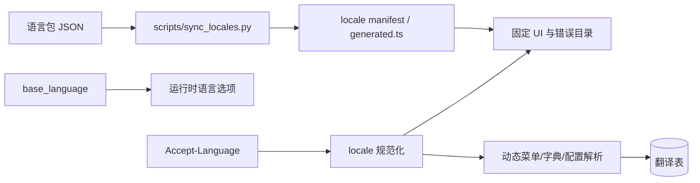

# 国际化设计

本文描述仓库当前已经实现的国际化边界、运行时行为和数据职责。新增语言的具体操作以[国际化语言扩展指南](国际化语言扩展指南.md)为准。

## 当前结论

| 内容 | 当前实现 |
| --- | --- |
| 固定语言包 | `zh-CN`、`zh-TW`、`en-US`、`ja-JP`、`ko-KR`、`fr-FR`、`es-ES` |
| 编译期默认语言 | `zh-CN` |
| 动态资源主语言 | 由 `base_language.is_primary` 决定 |
| 固定文案 | 三个前端 workspace 的 core/System JSON 语言包 |
| 后端错误 | `backend/internal/i18n/locales` 的结构化 JSON 目录 |
| 运行时语言选项 | `base_language` 接口返回的已启用语言 |
| 动态资源 | 菜单、字典、字典项和系统配置翻译表 |
| 机器翻译 | 只生成草稿，不参与正常读取和写入链路 |

国际化不是把语言名称或翻译常量全部放进数据库。数据库负责部署配置，语言包负责编译期白名单和固定文案；新增语言必须同时更新两层。

## 运行时链路



### 编译期语言集合

`scripts/sync_locales.py` 扫描以下七个语言包目录，并额外校验代码生成器的 `catalog.json`：

```text
backend/internal/i18n/locales
frontend/admin/packages/core/src/locales
frontend/admin/packages/modules/system/src/locales
frontend/uni-app/packages/core/src/locales
frontend/uni-app/packages/modules/system/src/locales
frontend/taro-app/packages/core/src/locales
frontend/taro-app/packages/modules/system/src/locales
backend/internal/biz/system/admin/v1/codegen/locales/catalog.json
```

七个语言包目录的文件集合、固定 key 和占位符必须一致；`catalog.json` 还必须包含相同语言代码和固定字段。脚本生成后端 `core/pkg/locale/manifest.json`、六个前端 `generated.ts`，并校验管理端 Day.js 和 Element Plus 的 locale 映射。生成文件不能手工修改。

### 运行期语言配置

`base_language` 保存：

- `language_code`：规范的 BCP 47 语言代码；
- `language_name`、`native_name`：管理端和登录页展示名称；
- `status`、`sort`：是否可选及展示顺序；
- `is_primary`：动态菜单、字典和系统配置的主语言。

前端启动时先使用编译期包建立回退语言列表，再请求公共语言接口；数据库接口成功时以已启用语言和排序为准，失败时回退编译期语言列表。部署配置应只启用已经随包发布的语言，数据库记录本身不会生成缺失的语言包。

### 请求和回退

管理端 Axios、刷新令牌、fetch、SSE 和 Swagger 请求，以及 uni-app/Taro 的请求、上传和 SSE，统一发送规范化的 `Accept-Language`。后端按白名单匹配区域，未知值回退 `zh-CN`。

回退顺序如下：

```text
固定 UI：当前语言 -> zh-CN -> 安全默认文案
菜单/字典/配置：当前语言 reviewed 翻译 -> 主表主语言字段 -> 稳定 code/path
错误：当前语言 message_key -> zh-CN message_key -> 原始安全消息 -> INTERNAL_ERROR
```

运行时不展示裸 key、机器草稿、数据库错误、SQL 或第三方 provider 响应。

## 固定文案和错误目录

每个前端模块维护自己的 JSON 语言包，模块注册时校验语言集合、key、命名空间和占位符。core 维护通用能力，System 维护系统管理、个人中心和 AI 文案；模块不得直接修改另一个模块的语言包。

后端错误目录由 `go-i18n` 加载。Proto `buf.validate` 的 `id/message` 和 Go 中显式的 `WithMessageKey` 必须在 `zh-CN.json` 定义，其他语言保持相同 key 和占位符。检查命令为：

```bash
make -C backend i18n-check
```

错误对外保持现有 `code/reason`，只在 metadata 中补充稳定的 `message_key/message_args`，由响应边界按请求语言渲染 `message`。

## 动态资源翻译

动态翻译表与主表一一对应：

| 主表 | 翻译表 | 可翻译字段 |
| --- | --- | --- |
| `base_menu` | `base_menu_translation` | 菜单标题及相关展示字段 |
| `base_dict` | `base_dict_translation` | 字典名称 |
| `base_dict_item` | `base_dict_item_translation` | 字典项标签 |
| `base_config` | `base_config_translation` | 配置名称；文本和富文本配置值 |

创建或更新动态资源时，主语言文本写入主表；非主语言文本写入对应翻译表。主语言不在翻译表重复保存。运行时只读取 `reviewed` 译文，缺失或未审核时回退主表。

内置菜单、字典、字典项和系统配置的审核译文位于同版本 `translation.<locale>.up.sql`。迁移使用幂等的 `INSERT IGNORE`，不会覆盖已经维护的数据；已执行版本不能通过重写文件修复，必须增加新版本迁移。

## 机器翻译草稿

服务运行时的机器翻译通过 `kratos-kit/translator` 按 `backend/configs/translator.yaml` 选择 Provider，只存在于两个显式入口：

- `make -C backend i18n-draft`：检查或补齐后端错误目录缺失项；
- 管理端 `BaseTranslationService.GenerateTranslationDraft`：针对已保存的菜单、字典、字典项或配置生成单条草稿。

批量语言包和迁移草稿由 `make -C backend i18n-locales` 调用独立脚本生成，不属于正常服务请求链路。

草稿接口默认关闭，通过 `translator.enabled=true`、`I18N_TRANSLATION_DRAFT_ENABLED=true` 或应用 metadata 开启。服务端读取受控源文本，限制目标语言和单条 2000 字节大小，串行调用并使用 `translator.timeout` 配置的 HTTP 超时（默认 8 秒）；已有 `reviewed` 译文不会被覆盖。机器结果必须人工审核后才参与运行时读取或迁移。

Provider 只用于翻译草稿，不能用于登录、错误响应、普通 CRUD 或任意文本翻译代理。Provider 不可用时，固定语言包、已审核翻译和主语言回退仍必须正常工作。

## 代码生成

代码生成器使用 `backend/internal/biz/system/admin/v1/codegen/locales/catalog.json` 的固定模板，并从表级、字段级 `i18n_config` 读取业务名称和字段名称。生成页面会写入所有编译期语言的稳定 key；非主语言缺少必要配置时，正式生成前应先补齐并在预览中显示缺失项。

生成器不得把新的中文 UI 文案直接写入 Vue、Proto 或菜单 SQL。生成结果属于当前代码生成对象的 key 范围，不能覆盖其他模块或人工审核的翻译。

## 数据库迁移

新语言或新译文使用更高版本目录：

```text
backend/migration/assets/vX.Y.Z/mysql/
├── language.up.sql
├── language.description.md
├── translation.<locale>.up.sql
└── translation.<locale>.description.md
```

`make i18n-sync I18N_MIGRATION_VERSION=vX.Y.Z` 生成 `base_language` 初始化记录；`make -C backend i18n-locales I18N_LOCALE=<locale> I18N_MIGRATION_VERSION=vX.Y.Z` 会同时生成对应语言包和动态翻译草稿及迁移。生成后必须审核 SQL 和语言包，再提交同一版本的描述文件；已人工完成的语言包不要用批量脚本覆盖。

`base_language` 的启用状态、排序和主语言是部署配置，不应通过重新执行语言包同步脚本强行覆盖。生产环境不能修改已执行的迁移文件。

## 验证清单

新增或修改语言后至少检查：

1. `make i18n-sync` 和 `make -C backend i18n-check` 通过。
2. 管理端、uni-app、Taro 的 key 和占位符校验通过。
3. 语言接口失败时，三端仍能使用编译期回退列表。
4. 登录前、登录后、刷新和重新打开应用都能恢复语言选择。
5. 菜单、字典和配置在有审核译文、缺失译文和主语言切换时都能正确回退。
6. 校验、认证、权限和资源错误的 reason 不变，只本地化 message。
7. `go test ./...` 及受影响 workspace 的类型检查、lint 通过。

新增语言的逐步命令、文件清单和故障排查见[国际化语言扩展指南](国际化语言扩展指南.md)。
