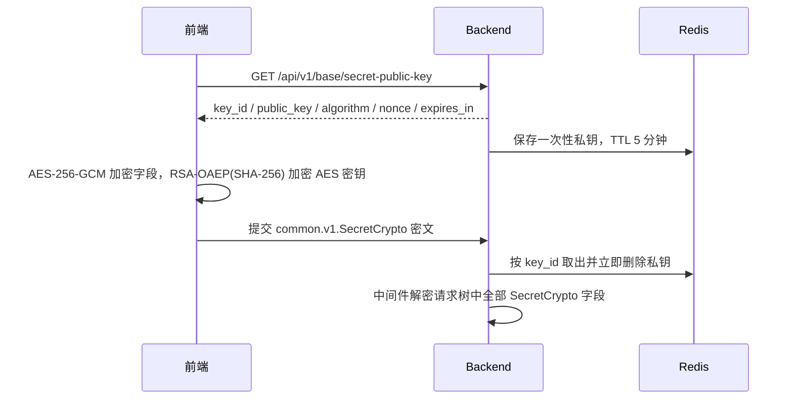

# 敏感字段加密设计

> 日期：2026-09-30；状态：传输加密、落库信封加密与眼睛查看已实施。

本文记录敏感数据在提交、存储、查看三个环节的加密机制。三者相互独立、按需组合：传输层保护请求在网络中的密文，落库层保护数据库列的静态存储，配置加密保护 YAML 文件中的敏感值。

| 层次 | 机制 | 保护对象 | 关键实现 |
| --- | --- | --- | --- |
| 传输 | `common.v1.SecretCrypto` 临时公钥加密 | 登录密码、修改密码、OAuth/消息 Provider 凭据、AI API Key、表单配置值等请求字段 | `kratos-kit/secretcrypto` 中间件 |
| 落库 | `SecretFieldRuntime` 信封加密 | `ai_provider.api_key`、`base_oauth_provider.client_secret`、`base_message_provider.client_secret`、`base_config` 敏感值 | `backend/adapter/kit/secretfield_storage.go` |
| 配置 | `ENC[...]` 密文前缀 | YAML 配置文件中的敏感值 | `kratos-kit/config` Decoder |

## 传输层：SecretCrypto 临时公钥加密

需要保密的请求字段在 proto 中声明为 `common.v1.SecretCrypto` 类型（定义于 kratos-core `api/proto/common/v1/types.proto`），包含 `key_id`、`nonce`、`algorithm`、`encrypted_key`、`iv`、`text` 六个字段。`text` 传输时为密文，服务端解密后回填明文。

- 公钥由 `base.v1.SecretCryptoService/GetSecretPublicKey`（`GET /api/v1/base/secret-public-key`）发放，位于 authn 白名单，无需登录。同一次提交的多个密文字段共用该公钥。
- 算法标识 `RSA-OAEP-256+A256GCM`；私钥写入缓存，TTL 5 分钟，取出即删，同一密文不能重放。
- 解密由 `kratos-kit/secretcrypto` 中间件统一完成，挂载于 gRPC 与 HTTP（`backend/internal/module/module.go`），递归处理请求消息树中全部 `common.v1.SecretCrypto` 字段，业务代码拿到的已是明文。
- 前端封装在三端 core 的 `src/utils/secretCrypto.ts`，优先 Web Crypto，缺少时回退 `asmcrypto.js`；协议细节与 HTTPS 边界见 [登录与密码加密流程](登录与密码加密流程.md)。

当前声明为 `common.v1.SecretCrypto` 的字段：

| Proto | 字段 |
| --- | --- |
| `base/v1/login.proto`、`mfa.proto`、`oauth.proto` | `password` |
| `system/admin/v1/auth.proto` | `old_pwd`、`new_pwd` |
| `system/admin/v1/base_user.proto` | `pwd` |
| `system/admin/v1/base_login_policy.proto` | `initial_password` |
| `system/admin/v1/base_config.proto` | `value`（表单配置整值） |
| `system/admin/v1/base_oauth_provider.proto` | `client_secret` |
| `system/admin/v1/base_message_provider.proto` | `client_secret` |
| `system/admin/v1/ai_provider.proto` | `api_key` |

## 落库层：SecretField 信封加密

`SecretFieldRuntime`（`backend/adapter/kit/secretfield_storage.go`）通过 GORM 回调把注册过的密钥列加密为信封密文后落库：

- 密文前缀 `sbox:v1:`；AES-256-GCM 加密，nonce 12 字节。
- 密钥由运行时主密钥按派生名 `kratos-admin:secret/field` 派生；AAD 绑定表名与列名，防止密文跨列挪用。
- 回调注册在 `gorm:before_create`、`gorm:before_update`（写入前加密）与 `gorm:after_query`（读出后解密）。
- 注册表为静态代码清单 `secretFieldColumns`：`ai_provider.api_key`、`base_oauth_provider.client_secret`、`base_message_provider.client_secret`。`oauth_client.client_secret` 已由 OAuth 凭据保护器单独加密，不在注册表内。

`base_config` 特殊处理：整值加密走代码注册表（KV 敏感 key 清单加表单 `SensitiveFields`，启动时由 `ConfigureConfigEncryption` 注入），JSON 表单值按点路径加密敏感字段；查询不自动解密，明文只允许 `GetConfigValue`、`DecryptSensitiveFields` 等显式出口，避免解密值混入免认证的运行时快照。

与脱敏存储策略互斥：配置了 `base_redact_storage_policy` 的表由 `SetProtectedTableChecker` 标记，信封回调跳过，同列由 redact 策略加密并在旁表保存原文。当前迁移种子已为上述三列配置 redact 加密策略，两套机制按该开关衔接，不会双重加密。

启动序列（`backend/internal/module/module.go`）：创建 secretcrypto 服务 → `ConfigureConfigEncryption` → `SetProtectedTableChecker` → `Backfill`（三张业务表存量明文回填，只处理非 `sbox:v1:` 前缀的行）→ `BackfillConfig`。绑定回调由 `backend/internal/data/secret_field.go` 在默认库上完成。

## 查看层：RevealSecretField

已落库的密钥不再回传列表，页面通过“眼睛”按需查看明文：

- 接口为 `system.admin.v1.SecretFieldService/RevealSecretField`（`POST /api/v1/system/secret-field/reveal`），请求 `resource`（如 `ai_provider`）+ `id` + `field`（如 `api_key`），返回 `text` 明文。
- 服务端校验 `resource + field` 必须在 `secretFieldColumns` 注册表内，未注册返回“密钥字段不存在”；接口纳入 casbin operation 授权，需在角色管理中为相应角色勾选。
- 管理端 system 模块启动时通过 `registerSecretRevealHandler` 注册查看回调；表单与列声明使用 `secret: { resource, field }` 加 `showPassword: true`，由 core 的 `SecretInput` 组件渲染并调用查看接口。已接入页面：AI 供应商、OAuth Provider、消息 Provider。

## 配置文件加密：ENC[...]

YAML 配置中的敏感值使用 `ENC[...]` 前缀密文，由 `kratos-kit/config` 的 Decoder 在加载时用静态密钥 AES-256-GCM 解密。它只作用于配置文件内容，与请求传输和落库加密无共享密钥。

## 关键入口

| 领域 | 路径 |
| --- | --- |
| 传输加密 Proto | `backend/api/proto/base/v1/secret_crypto.proto` |
| 密钥查看 Proto | `backend/api/proto/system/admin/v1/secret_field.proto` |
| kit 加解密与中间件 | `kratos-kit/secretcrypto`（backend 以 replace 引用） |
| 落库信封运行时 | `backend/adapter/kit/secretfield_storage.go` |
| 后端公钥与查看实现 | `backend/internal/biz/base/secret_crypto.go`、`backend/internal/biz/system/admin/secret_field.go` |
| 前端加密封装 | 三端 `packages/core/src/utils/secretCrypto.ts` |
| 眼睛组件与回调 | `frontend/admin/packages/core/src/components/ProForm/components/SecretInput.vue`、`frontend/admin/packages/core/src/utils/secretCrypto.ts` |

## 新增敏感字段

1. Proto 中把字段声明为 `common.v1.SecretCrypto`，执行 `make -C backend api` 生成产物。
2. 该列需要落库加密时，在 `secretFieldColumns` 注册表登记表名与列名；表单配置类敏感路径登记到 `runtimeconfig` 的 SensitiveFields 注册。
3. 管理端表单/列声明加 `secret: { resource, field }` 与 `showPassword: true`；需要查看明文的列确认角色已勾选 `RevealSecretField` operation。
4. 执行 `make i18n` 同步新增错误词条，`make -C frontend ts` 同步三端 RPC。
