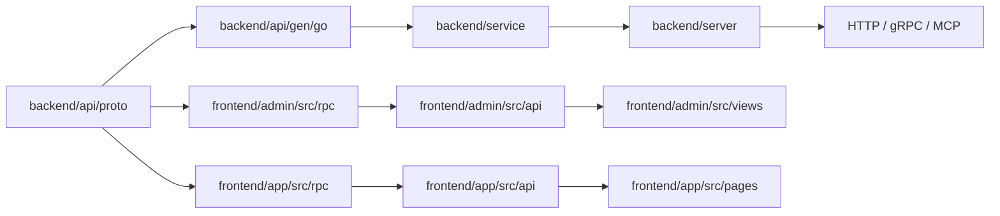

# 服务接入指南

本文只描述当前仓库已经实现的接入方式，适用于在现有 Kratos 服务中增加一个业务模块，并同时接入管理后台或应用端。

## 运行关系



当前服务包含三类协议：

| 协议包 | 后端目录 | 使用端 |
| --- | --- | --- |
| `base.v1`、`common.v1` | `service/base` | 管理后台和应用端共用能力 |
| `system.admin.v1` | `service/system/admin` | 管理后台 |
| `system.app.v1` | `service/system/app` | 应用端基础能力 |

HTTP 路径统一由 Proto 的 `google.api.http` 生成，业务接口使用
`/api/v1/{terminal}/{module}/{resource}` 形式。路径变更时，Proto、生成的 OpenAPI、
权限迁移和前端请求必须一起更新。

## 接入前准备

```bash
cd backend
make init                 # 首次安装 Go、Buf、Wire、GORM 生成器等工具
cd ../frontend
make init                 # 安装 admin 和 app 依赖
```

本地开发只需创建数据库，服务启动时会按当前模型建表并执行内置迁移：

```sql
CREATE DATABASE kratos_admin CHARACTER SET utf8mb4 COLLATE utf8mb4_unicode_ci;
```

默认服务地址为 `http://localhost:7001`，管理后台开发地址为
`http://localhost:8848`，应用端 H5 开发地址为 `http://localhost:5002`。

## 后端接入

### 1. 定义 Proto 契约

按终端选择目录：

```text
backend/api/proto/<module>/admin/v1   # 管理后台接口
backend/api/proto/<module>/app/v1     # 应用端接口
backend/api/proto/<module>/common/v1  # 确实跨端复用的类型
```

每个服务方法都要同时定义 HTTP 映射、中文注释和参数校验。例如：

```proto
service OrderService {
  rpc ListOrder (ListOrderRequest) returns (ListOrderResponse) {
    option (google.api.http) = {
      get: "/api/v1/admin/order/orders"
    };
  }
}
```

字段校验使用 `buf.validate`；格式校验放在 Proto，唯一性、存在性和状态流转等业务校验放在
`biz`。具体规则见[接口参数校验设计](接口参数校验设计.md)。

### 2. 生成协议和数据访问代码

先完成数据库表结构，再生成 GORM 代码；没有新表时从 Proto 开始：

```bash
cd backend
make gorm-gen            # 有新表或字段变化时执行
make api openapi         # 生成 Go 协议代码和 OpenAPI
make ts                  # 管理后台需要该接口时执行
make ts-app              # 应用端需要该接口时执行
```

以下目录是生成产物，不要手工修改：

- `api/gen/go`
- `pkg/gen`
- `internal/cmd/server/assets/openapi.yaml`
- `../frontend/admin/src/rpc`
- `../frontend/app/src/rpc`

### 3. 实现业务层和服务层

按当前目录职责实现：

```text
backend/service/<module>/dto       # 请求、响应和查询结果
backend/service/<module>/biz       # 业务用例、事务和权限边界
backend/service/<module>/*_service.go
backend/server/<module>/register.go # HTTP、gRPC、MCP 注册
```

服务层只负责接收生成的请求、调用 biz 并转换错误；数据库访问使用
`pkg/gen` 生成的 repository、model 和 query，不在运行时拼接 SQL。

### 4. 把模块挂到当前服务

传输层模块必须实现 `server.Module` 的三个方法：

```go
type Services struct {
    Order *orderservice.OrderService
}

var _ server.Module = Services{}

func (s Services) RegisterGRPC(*grpc.Server)       {}
func (s Services) RegisterHTTP(*http.Server)       {}
func (s Services) RegisterMCP(*mcpserver.Server)   {}
```

实际注册时分别调用生成代码的 `Register*Server` 方法。然后：

1. 在 `backend/service/<module>/init.go` 提供业务层 `ProviderSet`。
2. 在 `backend/server/<module>/register.go` 提供传输层 `ProviderSet`。
3. 在 `backend/app.go` 的 `ProviderSet` 中加入这两个 ProviderSet。
4. 在 `NewModules` 参数和模块列表中加入新的 `Services`，或将模块放入
   `AdditionalModules`。
5. 执行 `make wire`，不要直接编辑 `internal/cmd/server/wire_gen.go`。

当前仓库默认的 `wire.go` 使用 `AdditionalModules(nil)`；因此新增模块后必须在组合根显式加入，
不能依赖 `init()`、反射或运行时扫描隐藏模块。

### 5. 增加数据库迁移和权限

新增表、菜单、按钮、接口权限、字典或默认配置时，在同一版本目录中增加：

```text
backend/migration/assets/mysql/vX.Y.Z/<feature>.up.sql
backend/migration/assets/mysql/vX.Y.Z/<feature>.description.md
```

迁移脚本要可重复执行，不使用 `TRUNCATE` 等破坏性初始化语句。服务启动时会在默认数据库的
`base_migration` 表记录版本，并按 `business` 区分模块；只有
`backend/configs/data.yaml` 中 `enable_migrate: true` 时才会执行。

管理后台菜单的 `component` 必须和前端页面注册路径一致，`api` 中的接口标识必须和生成的
OpenAPI/Proto 服务名一致。权限数据变化后重启服务，检查 `base_api` 和 `casbin_rule`。

## 管理后台接入

### 直接维护当前后台

1. 在 `backend/api/proto` 增加 `system.admin.v1` 或业务管理端 Proto。
2. 执行 `cd backend && make api openapi ts`。
3. 在 `frontend/admin/src/api/<module>` 增加请求封装，统一使用现有 `request`。
4. 在 `frontend/admin/src/views/<module>` 增加页面，列表页沿用
   `ProTable + FormDialog + ProForm`。
5. 在迁移 SQL 中添加菜单、按钮和 API 权限。
6. 执行 `pnpm type:check`、`pnpm lint:oxlint`，再执行 `pnpm build`。

开发环境代理已经把 `/api`、`/events` 指向 `http://localhost:7001`。生产构建输出到
`backend/data/admin`，由后端通过 `/admin/` 托管。

### 作为前端模块被其他后台组合

`frontend/admin` 导出 `@liujitcn/kratos-admin` 包。业务后台提供视图加载器，再通过入口注册：

```ts
import {
  bootstrapAdminApp,
  defineAdminModule,
} from "@liujitcn/kratos-admin";

const orderModule = defineAdminModule({
  name: "order",
  views: import.meta.glob("./views/order/**/*.vue"),
});

void bootstrapAdminApp({ modules: [orderModule] });
```

后端菜单返回的 `component` 会在已注册模块中查找；菜单值例如
`order/list/index` 时，前端文件应能被 `import.meta.glob` 匹配。
构建可组合包使用 `cd frontend/admin && pnpm build:package`。

## 应用端接入

### 使用当前应用壳子

应用端请求统一放在 `frontend/app/src/api`，类型来自 `src/rpc`，页面放在
`src/pages` 或对应分包。新增应用接口后执行：

```bash
cd backend
make api ts-app
cd ../frontend/app
pnpm tsc
pnpm lint
```

H5 开发使用 `pnpm dev:h5`，微信小程序开发使用 `pnpm dev:mp-weixin`。H5 生产构建输出到
`backend/data/app`，后端通过 `/app/` 托管。

### 作为应用宿主组合

应用宿主使用 `@liujitcn/kratos-app`：

```ts
import { bootstrapKratosApp } from "@liujitcn/kratos-app";
import App from "./App.vue";
import pinia from "./stores";

export default function createApp() {
  return bootstrapKratosApp({
    app: App,
    pinia,
    modules: [{ name: "order" }],
  }).app;
}
```

Vite 配置中引入 `@liujitcn/kratos-app/vite` 的 `kratosApp()` 插件。插件会在构建期间合并
公共 `pages.json`；宿主同路径页面优先，缺失的公共页面自动生成临时 wrapper，构建完成后清理。
业务页面和分包仍由宿主维护，平台差异使用 uni-app 条件编译。

## 联调与交付检查

按以下顺序检查：

1. 后端 `go test ./...`，确认协议、Wire 和服务启动无误。
2. 管理后台执行 `pnpm type:check`、`pnpm lint:oxlint`；应用端执行 `pnpm tsc`、`pnpm lint`。
3. 登录后检查菜单是否出现、按钮是否按权限显示、接口是否返回正确租户范围。
4. 检查 `/api/docs/openapi`、`/admin/`、`/app/` 和需要的 `/events`、`/mcp` 路径。
5. 确认迁移脚本、生成产物和文档已与本次功能一起提交。
