# 登录与密码加密

本文记录管理端与应用端当前共用的账号密码、验证码、OAuth、密码密文和 Token 机制。接口以 `backend/api/proto/base/v1/login.proto`、`oauth.proto` 为准。

## 账号密码登录

```mermaid
sequenceDiagram
  participant UI as 前端
  participant API as Backend
  participant Cache as Redis
  UI->>API: GET /api/v1/base/config
  UI->>API: GET /api/v1/base/captcha
  UI->>API: POST /api/v1/base/captcha/verify（行为验证码）
  UI->>API: GET /api/v1/base/password-public-key?scene=LOGIN
  API->>Cache: 保存一次性私钥，TTL 5 分钟
  UI->>UI: RSA-OAEP + AES-GCM 加密密码
  UI->>API: POST /api/v1/base/session
  API->>Cache: 消费验证码和一次性私钥
  API-->>UI: access_token / refresh_token / expires_in
  UI->>API: GET 当前端 profile
```



未传租户编码时后端使用默认租户。账号按 `tenant_code + user_name` 查询；当前没有按独立 `phone` 字段登录的分支。

普通验证码把 `captcha_id` 和用户答案直接提交。滑块、点击、旋转等行为验证码先调用 `/api/v1/base/captcha/verify`，得到有效期 2 分钟的一次性 `captcha_token`，再把 token 作为登录的 `captcha_code` 提交。

## 密码协议

算法标识：

```text
RSA-OAEP-256+A256GCM
```

1. 前端请求指定场景的一次性 RSA 公钥。
2. 前端对密码执行 `trim()`，生成 32 字节 AES-256 密钥和 12 字节 GCM IV。
3. AES-GCM 加密密码，RSA-OAEP(SHA-256) 加密 AES 密钥。
4. Base64 编码后提交 `key_id`、`nonce`、`algorithm`、`encrypted_key`、`iv`、`ciphertext`。
5. 后端校验场景、nonce 和算法，从 Redis 读取并立即删除私钥，解密后用 `go-utils/crypto.Verify` 对比数据库密码哈希。

一次性密钥 TTL 为 5 分钟，读取后即删除。同一密文不能重放；失败重试必须重新取公钥并加密。

管理端和 H5 使用 Web Crypto。微信小程序使用静态引入的 `asmcrypto.js`、`wx.getRandomValues` 和微信 Base64 API，避免小程序环境的动态 import 兼容问题。

## 微信小程序 OAuth

应用端 `MP-WEIXIN` 使用 provider `wechatmini`：

1. `wx.login()` 获取 code，提交 `/api/v1/base/oauth/session`。
2. 已绑定或允许自动注册时直接返回 Token。
3. 未绑定时返回 `binding_required=true`，页面展示租户、用户名、密码和验证码。
4. 绑定提交前再次调用 `wx.login()`，再请求 `/api/v1/base/oauth/binding/session`。

微信 code 只能使用一次，探测绑定状态和正式绑定不能复用同一个 code。

管理端还支持 OAuth provider 列表、授权跳转、回调、绑定列表和解绑；具体 provider 由 `backend/configs/oauth*.yaml` 配置。

## Token

登录响应包含 `token_type`、`access_token`、`refresh_token` 和 `expires_in`。前端保存 `Bearer <access_token>`、refresh token 和换算后的绝对过期时间。

应用端请求层在 access token 剩余不超过 5 分钟时调用 `POST /api/v1/base/token`，并发刷新共用同一个 Promise。后端签发新的 access token，保留原 refresh token。刷新失败会清理本地登录态；登出会删除 access/refresh token 及 refresh token 对应的缓存认证信息。

公共认证请求使用 `authMode: "none"` 或等价配置，不携带旧 `Authorization`；需要登录的请求自动添加 Token。

## 关键入口

| 领域 | 路径 |
| --- | --- |
| 登录 Proto | `backend/api/proto/base/v1/login.proto` |
| OAuth Proto | `backend/api/proto/base/v1/oauth.proto` |
| 后端登录 | `backend/internal/biz/base/login.go` |
| 后端 OAuth | `backend/internal/biz/base/oauth.go` |
| 密钥生成和解密 | `backend/internal/biz/base/utils/password_crypto.go` |
| 管理端密码加密 | `frontend/admin/packages/core/src/utils/passwordCrypto.ts` |
| 应用端登录页 | `frontend/uni-app/packages/core/src/views/pages/login/login.vue` |
| 应用端密码加密 | `frontend/uni-app/packages/core/src/utils/passwordCrypto.ts` |
| 应用端 Token 和请求 | `frontend/uni-app/packages/core/src/utils/auth.ts`、`http.ts` |

排查登录失败时依次检查配置、验证码、公钥、密文场景、登录响应、Token 保存和 profile 请求。不要在日志或文档中记录明文密码、私钥、完整 Token 或验证码答案。
