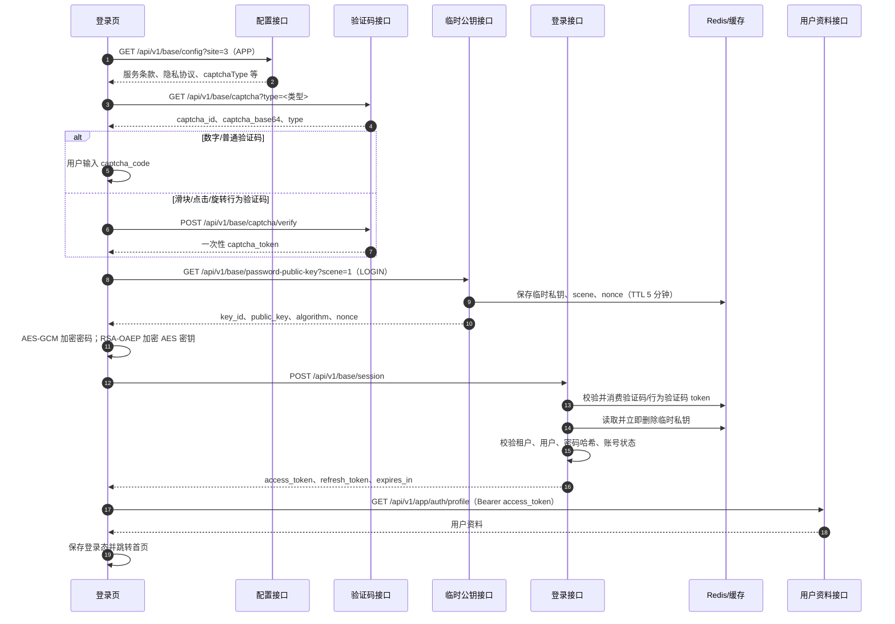
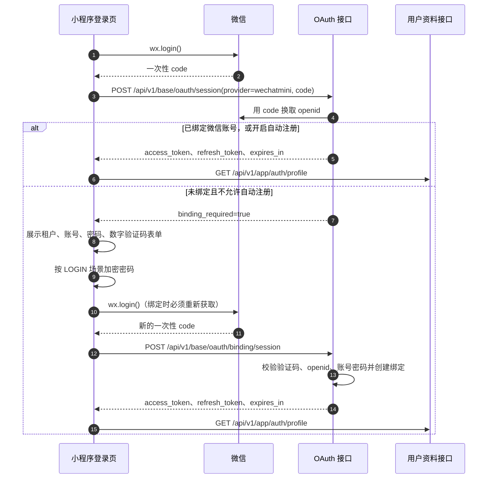

# 登录与密码加密流程

本文记录 `frontend/app` 当前 H5、微信小程序登录实现，以及 `backend` 对验证码、密码密文和 Token 的处理方式。接口路径以最终 HTTP 路径为准；前端 API 文件中的路径省略了 `/api` 基础前缀，默认由 `frontend/app/src/utils/http.ts` 拼接。

## 1. 总体流程

### 1.1 H5/账号密码登录



页面实际顺序是：加载 APP 配置 → 加载验证码 → 用户提交 → 获取临时公钥并加密密码 → 登录 → 获取用户资料 → 跳转。获取公钥发生在提交时，不在页面初始化时缓存。

配置枚举在当前前端请求中按数字发送：`BaseConfigSite.APP=3`、`PasswordCryptoScene.LOGIN=1`。文档中的 `APP`、`LOGIN` 是对应的语义名称。

### 1.2 微信小程序登录



`wx.login()` 返回的 code 只能使用一次。第一次 code 用于探测绑定状态，进入绑定流程后必须再次调用 `wx.login()`，不能复用旧 code。

## 2. 关键接口

| 方法 | 最终路径 | 是否需要登录 | 用途 |
| --- | --- | --- | --- |
| GET | `/api/v1/base/config?site=3`（`APP`） | 否 | 读取移动端协议、验证码类型等配置 |
| GET | `/api/v1/base/captcha?type=digit`（或配置类型） | 否 | 生成验证码 |
| POST | `/api/v1/base/captcha/verify` | 否 | H5 行为验证码预校验，返回一次性 token |
| GET | `/api/v1/base/password-public-key?scene=1`（`LOGIN`） | 否 | 获取一次性密码加密公钥 |
| POST | `/api/v1/base/session` | 否 | 账号密码登录 |
| POST | `/api/v1/base/oauth/session` | 否 | 微信小程序 code 登录/查询绑定状态 |
| POST | `/api/v1/base/oauth/binding/session` | 否 | 校验已有账号并绑定微信 |
| POST | `/api/v1/base/token` | 否 | 使用 refresh token 刷新 access token |
| GET | `/api/v1/app/auth/profile` | 是 | 登录后读取当前用户资料 |
| DELETE | `/api/v1/base/session` | 是 | 登出并清理服务端 Token |

公共认证接口通过 `authMode: 'none'` 调用，并显式避免携带旧的 `Authorization`。所有请求还会添加 `source-client: miniapp` 请求头，这是当前移动端请求封装的实际行为。

账号定位当前由后端按 `tenant_code + user_name` 精确查询。登录页输入框虽然提示“用户名/手机号码”，但 `LoginCase` 没有独立的手机号查询分支；只有手机号已被写入 `user_name` 时，手机号字符串才可能直接登录。

## 3. 密码加密协议

### 3.1 不是单向哈希，而是混合加密

登录时传输的 `password` 是 `common.v1.PasswordCrypto` 对象，不是明文字符串，也不是把明文密码直接做一次固定哈希。协议名称为：

```text
RSA-OAEP-256+A256GCM
```

处理步骤：

1. 前端向 `/api/v1/base/password-public-key?scene=1` 请求一次性 RSA 公钥；`1` 是 `PasswordCryptoScene.LOGIN`。
2. 前端先执行 `password.trim()`，再随机生成 32 字节 AES-256 密钥和 12 字节 GCM IV；因此密码首尾空格不会参与校验。
3. 使用 AES-256-GCM 加密处理后的密码，得到 `ciphertext`（包含 GCM 认证标签）。
4. 使用 RSA-OAEP、SHA-256 将 AES 密钥加密，得到 `encrypted_key`。
5. 将二进制字段 Base64 编码，连同 `key_id`、`nonce`、`algorithm` 组成请求。
6. 后端从缓存取回临时 RSA 私钥，解出 AES 密钥，再解出明文密码。
7. 后端使用 `go-utils/crypto.Verify` 将明文密码与数据库中的单向密码哈希比较。

数据库中的密码哈希由新增用户、重置密码和修改密码流程生成；登录流程不会把解出的明文重新写入数据库。

### 3.2 密文结构

```json
{
  "key_id": "临时密钥 ID",
  "nonce": "服务端返回的随机值",
  "algorithm": "RSA-OAEP-256+A256GCM",
  "encrypted_key": "Base64(RSA-OAEP(AES-256 密钥))",
  "iv": "Base64(12 字节 GCM IV)",
  "ciphertext": "Base64(AES-GCM(密码))"
}
```

服务端生成 2048 位 RSA 密钥对，并在缓存中保存以下记录：

```text
password_crypto:<key_id> -> private_key、nonce、scene、algorithm
TTL: 5 分钟
```

这里的 `nonce` 是服务端返回、用于绑定本次临时密钥的随机值；它和 AES-GCM 使用的 `iv` 是两个不同字段。

解密时服务端会检查：

- `key_id` 对应的临时密钥是否存在；
- `algorithm` 是否为 `RSA-OAEP-256+A256GCM`；
- `scene` 是否为 `LOGIN`；
- 请求中的 `nonce` 是否与服务端记录一致；
- RSA、Base64、AES-GCM 解密是否成功。

临时私钥读取后立即删除，因此同一份密码密文不能重放。公钥过期、重复提交同一密文或中途重试时，都必须重新获取公钥并重新加密。

### 3.3 H5 与微信小程序实现差异

| 平台 | 实现 |
| --- | --- |
| H5 | 使用 `globalThis.crypto.subtle` 的 RSA-OAEP(SHA-256) 和 AES-GCM；使用 `TextEncoder`、`atob/btoa` 编解码 |
| 微信小程序 | 静态引入 `asmcrypto.js`；使用 `wx.getRandomValues`、`wx.base64ToArrayBuffer`、`wx.arrayBufferToBase64`；手工解析 RSA SubjectPublicKeyInfo/DER，并实现 OAEP/MGF1/SHA-256 兼容逻辑 |

微信小程序不能依赖密码加密模块的动态 `import()`。动态导入被 uni 编译后可能变成 `vendor.js.then`，而小程序运行时该对象不是 Promise，就会出现：

```text
../common/vendor.js.then is not a function
```

当前实现已经改为静态导入 `asmcrypto.js`，避免该编译产物问题。

## 4. 验证码语义

### 普通验证码

数字、字符、算术等普通验证码直接将 `captcha_id` 和用户填写的 `captcha_code` 放入 `/base/session` 或微信绑定请求。后端根据 `captcha_id` 在缓存中找回生成时的验证码类型，再校验答案。

### H5 行为验证码

滑块、点击、旋转验证码的答案不直接提交登录：

1. `/base/captcha` 返回行为验证码数据；
2. 用户完成操作后调用 `/base/captcha/verify`；
3. 后端验证成功，签发有效期 2 分钟的一次性 `captcha_token`；
4. 前端把该 token 作为登录请求的 `captcha_code`，仍然携带原 `captcha_id`；
5. 登录阶段原始验证码答案未命中时，后端再按 `captcha_id + token` 校验并消费 token。

验证码或 token 过期、刷新验证码后仍提交旧的 `captcha_id`，都会得到“验证码错误”。

## 5. Token 生命周期

登录成功后返回：

```text
access_token
refresh_token
token_type = Bearer
expires_in（秒）
```

前端保存为：

- `access_token`：实际保存为 `Bearer <access_token>`；
- `refresh_token`：用于刷新；
- `expiresIn`：前端换算成绝对过期时间戳。

需要登录的请求由 `http.ts` 自动添加 `Authorization`。访问令牌剩余时间不超过 5 分钟时，请求层先调用 `/api/v1/base/token` 刷新。当前后端刷新接口返回原 refresh token，前端仍会重新保存它和新的 access token。刷新失败时：

- 必须登录的请求提示重新登录并清理本地登录态；
- 可选登录请求静默清理登录态。

登录页在保存 Token 后先请求 `/api/v1/app/auth/profile`。只有资料请求成功，才显示“登录成功”并跳转首页，因此“登录接口 200 但页面仍不跳转”应重点检查 Token 是否被保存、profile 请求是否 401/403，以及用户、角色、部门、租户是否启用。

## 6. 登录失败排查顺序

建议在浏览器 Network 或小程序 Network 中按以下顺序检查：

1. `config` 是否 200，且返回 `captchaType`、协议配置；缺失时登录页会在初始化阶段停止。
2. `captcha` 是否 200，登录提交的 `captcha_id` 是否就是最近一次返回的 ID。
3. `password-public-key` 是否 200，响应的 `algorithm` 是否为 `RSA-OAEP-256+A256GCM`。
4. 登录请求的 `password` 是否包含六个字段，且没有把明文密码或旧密文重复提交。
5. `/base/session` 或 `/oauth/binding/session` 的错误属于验证码、租户、账号密码、账号状态还是密钥过期。
6. 登录成功后 `/app/auth/profile` 是否携带 `Authorization: Bearer ...` 并返回 200。
7. H5 开发环境是否命中同源 `/api` 代理；小程序真机是否能访问配置的后端 HTTPS 域名并通过域名校验。

如果用户输入的是手机号，先确认该手机号是否实际存放在用户的 `user_name` 字段；当前后端不会按独立的 `phone` 字段查找登录用户。

对微信小程序还要额外检查：`wx.login()` 是否在绑定提交时重新调用，以及 `provider` 是否为 `wechatmini`。未绑定账号不是密码错误，而是正常返回 `binding_required=true` 后进入绑定页面。

## 7. 代码入口

| 领域 | 文件 |
| --- | --- |
| 登录页与 H5/小程序分支 | [`frontend/app/src/pages/login/login.vue`](../frontend/app/src/pages/login/login.vue) |
| 前端密码加密 | [`frontend/app/src/utils/passwordCrypto.ts`](../frontend/app/src/utils/passwordCrypto.ts) |
| 请求基址、鉴权头、Token 刷新 | [`frontend/app/src/utils/http.ts`](../frontend/app/src/utils/http.ts) |
| Token 本地存储 | [`frontend/app/src/utils/auth.ts`](../frontend/app/src/utils/auth.ts) |
| 用户登录态 Store | [`frontend/app/src/stores/modules/user.ts`](../frontend/app/src/stores/modules/user.ts) |
| 登录接口封装 | [`frontend/app/src/api/base/login.ts`](../frontend/app/src/api/base/login.ts) |
| OAuth 接口封装 | [`frontend/app/src/api/base/oauth.ts`](../frontend/app/src/api/base/oauth.ts) |
| 登录接口契约 | [`backend/api/proto/base/v1/login.proto`](../backend/api/proto/base/v1/login.proto) |
| OAuth 接口契约 | [`backend/api/proto/base/v1/oauth.proto`](../backend/api/proto/base/v1/oauth.proto) |
| 密码密钥生成与解密 | [`backend/service/base/utils/password_crypto.go`](../backend/service/base/utils/password_crypto.go) |
| 登录、验证码、账号校验、Token 签发 | [`backend/service/base/biz/login.go`](../backend/service/base/biz/login.go) |
| 微信 OAuth 与账号绑定 | [`backend/service/base/biz/oauth.go`](../backend/service/base/biz/oauth.go) |
| profile 与登录态鉴权 | [`backend/service/system/app/biz/auth.go`](../backend/service/system/app/biz/auth.go)、[`backend/pkg/middleware/auth.go`](../backend/pkg/middleware/auth.go) |
