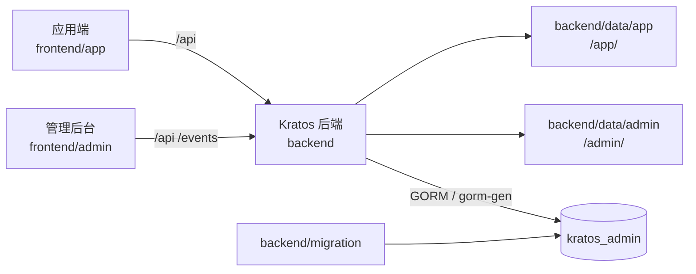

# 系统总体设计

本文描述当前仓库的运行边界、模块关系和生成链路。启动命令以根目录及各模块
README 为准，新增功能的具体接入步骤见[服务接入指南](服务接入指南.md)。

## 模块边界

| 模块 | 技术与职责 | 运行产物 |
| --- | --- | --- |
| `backend` | Go、Kratos、GORM；提供 HTTP、gRPC、SSE、MCP、任务和静态资源托管。 | API、OpenAPI、服务端进程 |
| `frontend/admin` | Vue 3、Vite、TypeScript、Element Plus、Pinia；提供管理后台。 | `backend/data/admin` |
| `frontend/app` | uni-app、Vue 3、TypeScript、Vite、Pinia；提供基础应用壳子。 | `backend/data/app` |
| `backend/migration` | MySQL 版本化迁移、默认数据和权限模板。 | 数据库表、菜单、角色和配置 |
| `docs` | 当前实现、开发约束和接入流程。 | 项目文档 |

不属于当前运行链路的旧目录、旧 SQL 入口和未落地的方案不在本文维护。

## 运行关系



本地开发时，两个前端通过 Vite 代理访问 `http://localhost:7001`。生产构建分别写入
`backend/data/admin` 和 `backend/data/app`，由后端按 `/admin/`、`/app/` 托管。

## 接口契约

协议统一放在 `backend/api/proto`，目录和 package 对齐：

| 域 | 协议包 | 后端服务 | 前端调用 |
| --- | --- | --- | --- |
| 公共能力 | `base.v1`、`common.v1` | `service/base` | `frontend/admin`、`frontend/app` |
| 管理后台 | `system.admin.v1` | `service/system/admin` | `frontend/admin/src/api` |
| 应用端 | `system.app.v1` | `service/system/app` | `frontend/app/src/api` |

生成链路为：

```text
Proto
 ├─ make api       -> backend/api/gen/go
 ├─ make openapi   -> backend/internal/cmd/server/assets/openapi.yaml
 ├─ make ts        -> frontend/admin/src/rpc
 └─ make ts-app    -> frontend/app/src/rpc
```

生成文件不能手工修改。接口变更时，按“Proto → 生成 → 后端实现 → 前端调用 → 迁移权限”
顺序完成同一次改动。

## 服务启动

1. 创建 `kratos_admin` 数据库。
2. 启动 `backend`，按当前模型建表并执行 `backend/migration/assets/mysql` 下尚未执行的版本。
3. 启动需要的前端开发服务，或将生产构建产物放入 `backend/data`。

默认地址：

| 服务 | 地址 |
| --- | --- |
| 后端 HTTP | `http://localhost:7001` |
| 后端 gRPC | `localhost:6001` |
| 管理后台开发服务 | `http://localhost:8848` |
| 应用端 H5 开发服务 | `http://localhost:5002` |

## 文档索引

| 主题 | 文档 |
| --- | --- |
| 后端结构和生成 | [后端服务设计](后端服务设计.md)、[backend README](../backend/README.md) |
| 前端页面和权限 | [管理后台设计](管理后台设计.md)、[frontend/admin README](../frontend/admin/README.md) |
| 服务接入 | [服务接入指南](服务接入指南.md) |
| 数据库与迁移 | [数据库与初始化数据设计](数据库与初始化数据设计.md) |
| 模块边界 | [模块设计方案](模块设计方案.md) |
| 接口校验 | [接口参数校验设计](接口参数校验设计.md) |
| AI 助手 | [AI 助手设计](AI助手设计.md) |

## 设计原则

- 服务端负责契约、认证、权限、状态转换和数据一致性，前端负责交互与展示。
- 基础模块通过 `server.Module` 和 Wire 显式装配，禁止使用隐式注册。
- 初始化数据用于新环境；存量环境的结构变化必须新增可审计的版本迁移。
- 管理端和应用端都只消费生成的 RPC 类型，避免重复维护接口模型。
